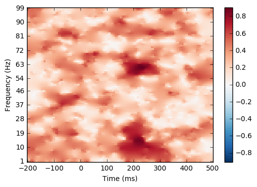
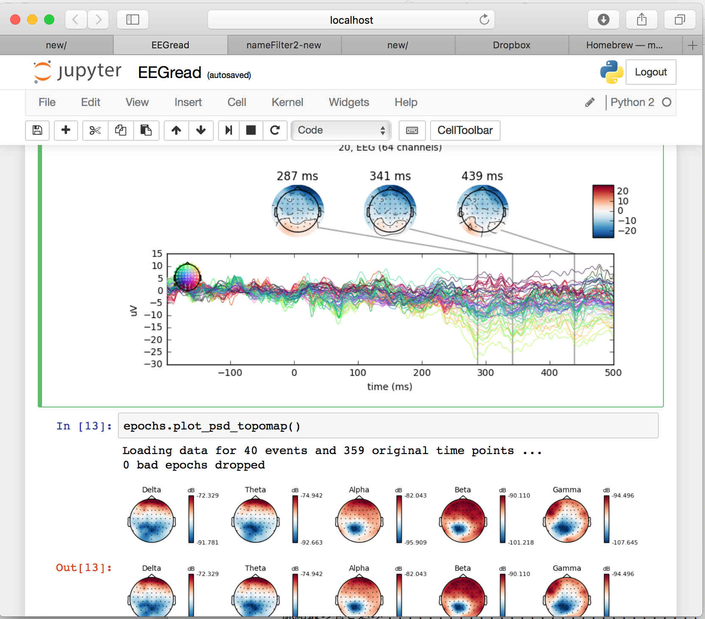
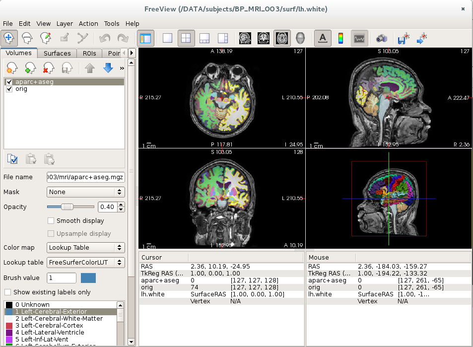
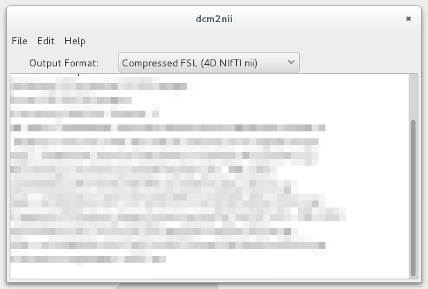
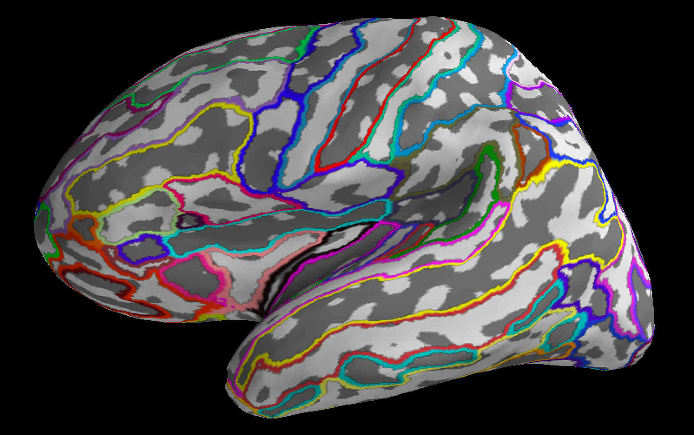
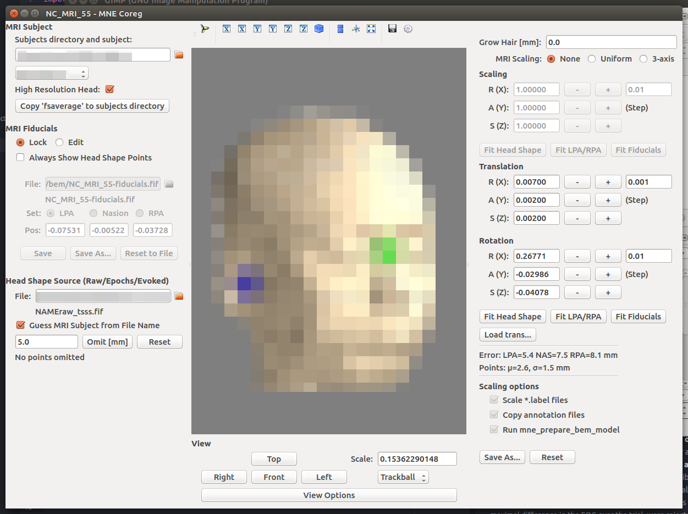

\newpage
# はじめに
現代では脳は電気で動いている、と信じられています。
しかし、どのような挙動なのかはまだまだ分かっていません。
だから、貴方は研究をしたくなります。(それは火を見るより明らかです)
しかし、脳の解析は難しく、技術的な入門書、特に和書に乏しい現状があります。
だから同人誌を書くことにしました。
本書では脳磁図、脳波、MRI解析を「体で覚える」べく実践していきます。
さぁ、MNE/python、freesurferの世界で良い生活を送りましょう！

…というか、周りにMNEpython使いほとんど居ない…一人じゃ辛い。

## 本書の目的・限界・対象者・使い方
MNE/pythonやfreesurferを用いて脳内の電源推定…特にソースベース解析を行うための
解析環境の構築と解析の基礎を概説します。可能な限り効率的な解析環境を構築し、楽をします。
僕が個人的に考えている事もちょくちょく書きます。

本書の限界は僕のスキル不足（１年と少しかやっていない）と、これが同人誌であることです。
初心者の書いた不確実なものとして、疑って読んでいただければ幸いです。

本書の対象者は以下のとおりです

- 脳磁図計を使って脳の生理学的研究をしたい初心者
- 脳磁図計を使って研究しているけれど、コーディングが苦手な中級者
- 頭部MRI研究でfreesurferを使いたい初心者
- 脳波研究で、応用的な解析をしたい初心者
また、前提条件としてターミナルやプログラミングを怖がらないことがあります。
(プログラミング未経験者の質問にも出来るだけ答えたいと思います)

脳研究の経験者は[MNE/pythonとは](#MNEpythonとは)から読んでいけばいいです。
MNE/freesurfer経験者なら[OSの準備](#OSの準備)から読めばいいです。
コンピュータは自転車みたいなもので、基本は体で覚えていくしかないと思っています。
分からなければググることが大事です。qiita[^qiita]等で検索するのも良いでしょう。

## センサーベース/ソースベース解析とはなんぞや
脳の中の電気信号を調べる方法としては脳波や脳磁図[^meg]が有名です。
脳波や脳磁図のセンサーで捉えた信号を直接解析する方法を
センサーレベルの解析と言います。これは伝統的なやり方であり、
今でも多くの論文がこの方法で出ている確実な方法です。

しかし、脳波や脳磁図は頭蓋骨を外して直接電極をつけないと
発生源(僕達はソースと呼びます)での電気活動はわかりません[^doubutsu]。
普段計測している脳波・脳磁図は所詮は「漏れでた信号」に過ぎないのです。
では、一体どうすれば脳内の電気信号を非侵襲的に観察できるのでしょうか？
方法は残念ながら**ない**[^nai]のですが、推定する方法ならあります。
その中の一つの方法として、脳磁図とMRIを組み合わせ、
MNEというpythonモジュールを使って自ら解析用スクリプトを実装する方法があります。
ソースベース解析というのはあくまで推定であり、
先進的である一方でまだまだ確実性には劣るやり方との指摘もあります。

ちなみに、脳波のソースベース解析もあるにはあるのですが、
脳波は電流であるため磁力と違って拡散してしまう性質があります。
実際、脳波でのソースベース解析とセンサーベース解析の結果が
不一致であったという研究が発表されています。[^huicchi]

## スラングや用語の説明とunix系のお約束
本書では下記の言葉を使っています。伝統的なスラングを含みます。
適宜読み替えていってください。それ以外にも色々スラングあるかもです…。

- hoge:貴方の環境に応じて読み替えてください、という意味のスラング
 fuga,piyoも同じ意味です。ちなみにこれは**日本語**です。
- 叩く:(コマンドをターミナルから)実行するという意味の他動詞
- 回す、走らせる:重い処理を実行するという意味の他動詞
- ターミナル:いわゆる「黒い画面」のこと。Macならユーティリティフォルダにある。
- .bash_profile:ホームディレクトリにある隠し設定ファイルです。
 環境によって.bashrcだったりしますし、両方あることもあります。
 貴方の環境でどちらが動いているか(両方のこともある)確認して設定してください。
- 実装:プログラミングのことです。プログラムを書くことです。

本書で「インストールにはこうします」とか言ってコマンドを示した場合は
文脈上特に何もない場合、ターミナルでそれを叩いてくださいという意味です。
pythonの文脈になったらpythonです。この辺りは見慣れれば判別できます。

\newpage

## それぞれの研究に必要な環境・特色のまとめ
本書ではまず環境を構築しますので、色々インストールが必要です。
必要物品についてまとめると下記です。

- 脳波研究
 python(本書ではanaconda使用)、MNE/python
 安価で普及していますが、まだ多くの謎が眠っている分野です。
 脳の深部の信号に強いですが、空間分解能が低いです。
- MEGセンサーレベル研究
 python(本書ではanaconda使用)、MNE/python、MNE/C、ELEKTA製maxfilter
 ノイズに弱く、脳の深部に弱く、莫大な資金が必要な希少な機器です。
 それさえクリアできれば処理の重い脳波みたいなものです。
 ※ノートでは厳しいです。
- MRI研究
 freesurfer、mricron
 莫大な資金が必要ですが、それなりに普及しています。
 ネタが尽きようとも、新たな理論を持ち出してくる根性の分野です。
 ※ノートでは無理です。
 ※コネクトームを解析する場合はanaconda必要
- MEG+MRIソースレベル研究
 MEGとMRIを組み合わせた応用編となるため、紹介したものの全てが必要です。
 本書の本題です。MRIの空間分解能と脳磁図の時間分解能を備えた
 まさに　**†最強の解析†**　…のはずなんですが、どうなんでしょうね？
 あまり頭の良くない僕にはこの理論はあまりに難しく、頭がクラクラします。
 ※膨大な計算量が必要なため、ワークステーションが必要です。

[^qiita]:日本のプログラマ用のSNSの一つです。

[^doubutsu]: 動物実験では脳に電極刺す実験はされていますが、人には刺せません。

[^meg]: 脳波は電気信号を捉えますが、脳磁図は磁場を捉えます。電気と違って拡散しないので空間分解能に優れますが、ノイズに弱いです。超電導を使うので値段も高いです。http://www.elekta.co.jp/products/functionalmapping.html

[^nai]: 他に脳の活動を調べる方法として磁力を照射するfMRIや赤外線を照射するNIRSなどがあります。fMRIは電気信号ってわけでも無さそうです。NIRSは赤外線で脳血流を捉えるのですが、頭皮の血流をいっぱい拾ってしまうので大変です。

[^huicchi]:http://biorxiv.org/content/early/2017/03/29/121764

## MNE/pythonとは
脳磁図を解析するためのpython[^python]用numpyベースのモジュール(関数の集まり？)です。
自由度が非常に高いです。(引き換えに難易度が高いです。)
wavelet変換、コネクティビティ、その他あらゆる事が出来ます。
出来るのですが…使いこなすためには深い深い生理学の知識が必要です。
ちなみに元来脳磁図用なのですが、脳波を解析することも出来ます。
C言語で実装されたMNE/Cというのもあり、併用する必要があります。
最近はMNEpythonに機能を移しているそうですが、移行はまだ完全ではないからです。
両方共フリーウェアですが、MNE-Cは登録が必要です。
開発は活発で、最近新バージョンとして[MNE/python 0.14](http://martinos.org/mne/stable/index.html)と
[freesurfer6.0](https://surfer.nmr.mgh.harvard.edu/)とpython3.6が、立て続けにリリースされました。
導入と紹介を書いていこうと思います。ちなみに、新しければいいというわけではないです。
python3.6は使いません。(´・ω:;.:...

{width=14cm}

[^python]:コンピュータ言語の一つ。速度を犠牲にして、書きやすさを追求した言語。科学計算の世界では現時点では広く普及しています。MATLABと似ていますが、pythonは無料でオブジェクト指向の汎用言語なので、応用範囲がスマホアプリにまで及び、習得して損をすることはまずないでしょう。

## freesurferとは
頭部MRIを解析する為のソフトです。自動で皮質の厚さやボリュームを測れるだけでなく最近は
fMRIでコネクティビティの算出が出来るようになるなど、かなり賢いです。
反面、激重な上にサイズが大きくbash使う必要があります。
その上、違うCPU使ったら結果が変わる仕様があり、正しく扱わないとジャジャ馬とかします。
最近頭部MRI研究で勢力を伸ばしつつあり、最早スタンダードの一つだそうです。フリーウェアです。

## それぞれのソフトの関係性〜それofficeに例えるとどうなの？〜
いきなりMNEpythonと言われても初心者にはよくわからないようです。
unix系もコンピュータ言語も触ったことない人には例え話のほうが良いかもしれないので、
初心者のために、登場するソフトの名前を例え話で話してみます。
凄く乱暴な例えではあります。

|MNE|役割|オフィスに例えると？|
|--|--|--|
|anaconda,pip,homebrew|ソフトをインストールするソフト|app store,google play,人事部|
|spyder,jupyter|実際に色々書いたりするソフト|word,excel,筆記用具|
|python|言語|日本語、命令書の書式|
|MNE|言語で動く命令セット|excelの関数、社内文書に従って動く部下|
|mricron|変換・表示用ソフト|画像変換ソフト,通訳|
|freefurfer/freeview|MRI画像処理ソフト|photoshop,何でも一人でこなそうとする部下|
|ELEKTA製ソフト|MEGを運用する|スキャナ、取材班|

\newpage

## MRIと脳磁図計とELEKTA製ソフトの準備

必須ですが　**†億単位の金†**　が必要なので本書では割愛します。
読者の中で買える人が居るなら買うと良いんじゃないかな。

## コンピュータの準備

必要な性能はどこまでやるかにもよります。脳波解析なら普通の市販のノートでも十分です。
MRIやソースベース解析やるなら高性能なのがいいです。
また、高性能でも24時間計算し続けるような場合ノートではダメです。
その場合は大型ワークステーション…小さくてもデスクトップ機を使って下さい。
ノートは性能に限界があるだけでなく、排熱機構が弱いので
数日計算し続けると火災が発生する可能性があります。[^note]
メモリいっぱい、CPUは多コアがいいです。ソースベース解析するならquadroとか載ってるやつも
良いかもしれないです[^nedan]。どの程度のものが必要かは実験系によります。
メモリが大量に必要で、GPUよりCPU使う場面が多いため重視する性能は
メモリ＞CPU＞GPUと思います。
freesurferはOSやCPUが変わったら結果が変わるという仕様がありますから
「このコンピュータを使う」と固定する必要があります。

[^note]:あくまで本番環境ではの話です。例えばノートを通してサーバーやワークステーションを動かすとか、スクリプトの雛形を作るという用途であればソースベース解析でもノートは実用性に優れています。

[^nedan]:ブランドにこだわらずに探せば20コアとかのマシンが40万円も出せば買えます。グラボはnVidia製にして下さい。AMDは科学計算に弱いです。

## OSの準備
OSはlinuxかMACが必要で、windowsでは仮想環境なしではつらいです[^win]。
かなり性能を要求する処理となると思われるためwindows+仮想環境はおすすめしません。
freeBSDも出来るかも分かりませんが、僕はしていません。
僕は新しめのdebian系linuxであるUBUNTU[^ubuntu]またはMACを使います。

[^win]:実はwindowsでもbash on windowsというunix系互換機能がありますが、出来たばかりであまりユーザーも多くないでしょう。

[^ubuntu]:UBUNTUはCanonical社によって開発されているオープンソースのlinuxディストリビューションであり、人気があります。debianというディストリビューションをベースに作られています。

linuxでも新しめのメジャーなlinuxディストリビューションを勧める理由は
CUDA等の技術に対応していたり、ユーザーが難しいことを考えなくて良いことが多いからです。
debian系を使う理由はパッケージ管理ソフトのaptが優秀でユーザーが多いことです。
MACの場合はaptの代わりにhomebrew(https://brew.sh/index_ja.html)を用いることになります。
以下、UBUNTU16.04LTSかmacos10.12を想定して書いていきます。
UBUNTU16.04LTSは下記サイトから無料でダウンロードできます。

https://www.ubuntulinux.jp/ubuntu

僕自身は少しでも速く処理して欲しいので、誤差範囲かもですがlinuxでは軽量デスクトップ環境に
変えています…ここは任意です。MACを使う場合はhomebrewというパッケージマネージャを
インストールすると色々楽になることがあります。
https://brew.sh/index_ja.html

# 開発環境の準備（脳波、脳磁図の場合。出来るだけリッチに。）

- freesurferだけ使う人は開発環境は要りません。読み飛ばして下さい。
- 試すだけだとか、質素な開発環境でいい人も読み飛ばして下さい。

開発環境はMNE使うなら必要です。詳しい人からは「docker[^docker]じゃダメなん？」という質問が
来そうですが、ライセンスの問題がありますし、セットアップは自分でできなければ
困ることもありましょう。僕はanaconda[^conda]を使います。何故ならインストールが楽だからです。

[^docker]:最近流行りの仮想化環境です。性能が高いのが特徴ですが、反面使いこなすのには力が必要です。

[^conda]:anacondaとはContinuumAnalytics社で開発されているデータサイエンティスト向けのpythonディストリビューションです。もちろん好みに応じてpyenvなどを使うのもありと思うのですが、mayaviというインストールの鬼門が存在するのでanacondaが楽です。

https://www.continuum.io/downloads

このサイトからインストールプログラムをダウンロードします。
anacondaは2と3があり、それぞれpython2と3に対応しています。2を使って下さい。
3は現時点ではメリットはありませんが、そのうちpython2自体のサポートが切れるので
いずれ必要になるかもわかりません。
anacondaにspyderというIDEが付いてくるのでそれを使うのもいいでしょう。
spyderはとても素直な挙動のIDEでipythonの補完機能も手伝って使いやすいです。
しかし、僕のおすすめはjupyter+anaconda2で多言語切り替えながら使う方法です。
jupyterはwebベースの開発環境で、他の人とデータやソースコードの共有が容易なので捗ります。[^kirikae]


{width=14cm}

{width=14cm}

[^kirikae]: 僕がjupyterを推す他の理由としてはクラスタ化して並列計算でゴリ押しが出来ること、有名なスクリプト言語の殆どに対応している事が挙げられます。

MACはanacondaのインストーラーをダウンロードしてクリックしていけばどうにかなります。
linuxではanacondaはダウンロード後、ターミナルで以下のようにコマンドを叩いて
インストールします。bashです。ただのshじゃインストールできません。

```{frame=single}
bash Anaconda3-4.3.0-Linux-x86_64.sh
```

インストール先はホームフォルダでいいかとか、色々質問が出てきますが、
そのままホームフォルダにインストールするのが~~気持ち悪くても~~スムーズに行くかと思います。

## jupyterの設定(やり得)

素のjupyterでも強力ですが、折角なので拡張しておきましょう。ターミナルで下記を叩いてください。

```{frame=single}
conda install -c conda-forge jupyter_contrib_nbextensions
jupyter contrib nbextension install --user
ipcluster nbextension enable --user
```

これでextensionが使えるようになります。jupyterは機能が拡張できるので便利です。

\newpage

## jupyterでのplot

jupyterはplotが直接画面に表示できます。
表示したい場合は、予め下記コードをjupyter上に書いておいてください。
```{frame=single}
%matplotlib inline
%gui qt
```
これについては後でまた詳しく記載します。

## python2,3二刀流(現時点では不要)

このセクションは必要ありませんが、将来的にきっと
python2から3に移行する時がMNEにもやってくると思いますので記しておきます。

python2と3を二刀流すべくキーボードを叩きます。現時点ではmayaviと言う
結果の図示に必要なモジュールが古い環境でしか動かず、通常はpython2系を使うべきと考えます。
以下、anaconda2から入れた場合です。逆の場合python2.7と読み替えて下さい。

```{frame=single}
ipython kernel install --user
conda create -n python3 python=3.6 anaconda
source activate python3
ipython kernel install --user
conda info -e
```
1行目から順に何をやっているか述べます。

1. 今のpython2の環境をjupyterに載せておく
1. condaで別バージョンのpython環境を作る
1. 切り替える
1. jupyterに組み込む
1. 確認

source activateコマンドでpythonの環境を切り替えられます。これでjupyterでpython2と3を
切り替えられると思います。ちなみに間違って環境を作った場合は以下のコマンドで消せます。

```{frame=single}
conda remove -n python3 --all
```

## Rをjupyterで動かすために(非常に便利)

anacondaを使っているなら下記でRがインストールできます。
```{frame=single}
conda install libiconv
conda install -c r r-essentials
conda install -c r rpy2
```
これによりRが動くようになり、貴方は少しだけ楽になります。
何故なら、実験結果を同じ環境で動くRに吸い込ませられるので、
「実験結果を入力するだけでワンクリックで統計解析結果まで出る」[^toukei]ような
スクリプトが実現できるからです。具体的にはjupyter上で
```{frame=single}
%load_ext rpy2.ipython
```
とした後
```{frame=single}
%%R -i input -o output
hogehoge
```
という風に記述すればhogehogeがRとして動きます。plotも出来るし、引数、返り値も
上述のとおり直感的です。さて、この-iですが、通常の数字や一次元配列は普通に入りますが、
Rならデータフレームからやりたいものです。その場合はpandasというモジュールを使って
受け渡しをします。例えばこのような感じです。
```{frame=single}
import pandas as pd
data=pd.Dataframe([二次元配列])
```
```{frame=single}
%%R -i data
print(summary(data))
```

pythonとRをシームレスに使いこなすことがこれで出来るようになります。

# バージョン管理git

バージョン管理を知っているでしょうか？
貴方はスクリプトを書くことになるのですが、ちょっとしたミスでスクリプトは動かなくなります。
そんなリスクを軽減するために、貴方はスクリプトのコピーを取ります。
コピーを取り続けるうちに、貴方のコンピュータはスクリプトで埋め尽くされ、収集つかなくなります。
さらに、他の人がスクリプトを手直しする時、引き継ぎとかも大変です。
だから、貴方はgitを使ってください。
gitを知らない人は、とりあえずgithub desktopとかsource treeをダウンロードして
体でそれを知ってください。詳しくはgitでググってください。
こことか参考になります。
http://www.backlog.jp/git-guide/

## gitサーバー
git単体でもいけるのですが、折角だからgitのサーバーを導入してみましょう。
一番いいのはgithubのプライベートリポジトリを使うことなんですが有料です。
他にもbitbucketだとかgitlabとか色々あるのですが…僕自身は研究室のローカルなサーバーで
実現したかったんです~~趣味もある~~
なので、gitbucketを採用しました。gitbucketはgithubのクローンを目指して開発されたものです。

### gitbucket導入
gitbucketをググってgitbucket.warをダウンロードしてください。
で、javaというか、jdkをインストールします。めんどいんで詳しくはググってください。
http://www.oracle.com/technetwork/java/javase/downloads/jdk8-downloads-2133151.html

このまま
```{frame=single}
java -jar gitbucket.war
```
でも動くのですが、安定性に欠けるらしいので僕はPostgreSqlを導入します。

とりあえず、いくつかunixユーザーを作りましょう…。
そんで、データベース上に自分とgitbucketを登録します。

```{frame=single}
useradd postgres
passwd postgres
su postgres
createuser -d hoge
createdb hoge
createdb gitbucket
exit
```

上記で一応なんとかなると思うのですが、念のため確認を…
postgresqlにログインして下記を叩けばちゃんとデータベースが出来たかを確認できます。

```{frame=single}
\du
```

.gitbucket/database.confを下記のように書き直します。
```{frame=single}
db {
  url = "jdbc:postgresql://localhost/gitbucket"
  user = "test"
  password = "test"
}
```
で、
```{frame=single}
java -jar gitbucket.war
```

これでip+:8080にアクセスすればgitbucket動いてます。
(もちろん、これだけではセキュリティ面等、不十分です。
  セキュリティ詰める自信がないならローカルだけで使いましょう。)

## jupyterで作ったスクリプトのバージョン管理(小技)
jupyterを僕は使いますが、jupyterのファイルはgitしにくいです。
でも、何とかなります。

方法は2つありますが、僕は方法2が楽でいいと思っています。

### 方法1
```{frame=single}
jupyter notebook --generate-config
```
このコマンドでjupyterのコンフィグファイルが作成されます。場所は/home/hoge/.jupyterです。
その上で、下記URLに記載されている通りに書き加えます。
http://jupyter-notebook.readthedocs.io/en/latest/extending/savehooks.html
すると、jupyterで編集したファイルがpythonのスクリプトとしても保存されます。
あとはgit[^git]などで管理すればいいです。ただし、この方法は計算結果がファイル内に残りません。
しかも散らかります。
どちらかというと素直にpyファイルにしてダウンロードしてgitを使うほうが良いかもしれません。

[^toukei]:同様に、matlabやC等と連携をすることが簡単なのがjupyterの強みの一つと思います。
[^git]:プログラミング用バージョン管理ソフト。敷居は高いが多機能。

### 方法2
gitを使いますが、git側の設定だけでもどうにかなります。
まず、jqをインストールします。
.gitattibuteに書きを書き加えます。
無ければ作ってください。
```{frame=single}
*.ipynb diff=ipynb
```
そして、下記を.git/configに
```{frame=single}
[diff "ipynb"]
textconv=jq -r .cells[] |{source,cell_type}
prompt = false
```
下記を.gitignoreに
```{frame=single}
.ipynb_checkpoints/
```
これでjupyter notebookのファイルをgitで管理しやすくなります。

# 実験のディレイの測定
被験者に何かを見せたり聞かせたりしてその反応を脳波や脳磁図で拾ってくる実験をしたいとします。
脳はかなりの性能なので、30ms後には反応が始まります。
さて…ここで困ったことが起こります。実はコンピュータから画面やスピーカへ信号を送る時、
一瞬で届いてくれないことがあります。理由は、現代的なコンピュータは様々なタスクを
同時進行でやっていたり、性能を確保するために様々な工夫をしますが、それが仇になるのです。
実験中に他の処理が割って入ってきたり、工夫に時間を取られたりすると信号が一瞬で届きません。
なので、どのくらいの時間で出来るかを測定しておく必要があります。

ここでは僕がどうやったかを書いておきます。
僕がやったのは被験者の目の前の画面に図が表示されるまでと、
「画面提示しました」信号が脳磁図系に届くまでの差を調べることにしました。

## 必要物品

- オシロスコープ本体
picoscope2000というのを使いました。windowsで動きます。かなり可愛いオシロスコープですが、
入力2チャンネル、トリガー出力1チャンネル、μs単位の反応速度を持っています。
25000円くらいですが、家電量販店には売ってないです。

- センサー
これは明るくなると抵抗が減るダイオードです。
光センサがRPM22PBで200円くらいです。amazonで買ったあと品切れになりました。
他の通販サイトにはあるようです。センサ自体は手元にあと4つ余りがあります。
スペック上μs単位の反応速度のようです。

- 乾電池
上記センサは5Vくらいの電圧では全然問題ないため、
乾電池二本直列程度なら回路の途中に抵抗は要らないようでした。
あまり逆の電流は流さない方がいいのかもしれません。

- ヒートシュリンクチューブ
ドライヤーを当てると縮むチューブです。
光センサーが壊れたら嫌なのでヒートシュリンクチューブで守りました。

あとはジャンパー線、鰐口クリップ付BNC同軸ケーブル、
半田と半田ごて、電池入れが必要でした。BNC同軸ケーブル周りはやや入手難度が高かった印象です。

どのようにしたかというと、光センサーを電池につなげてオシロスコープに繋ぎます。
オシロスコープには2つの入力チャンネルがあるので、もう一方を刺激提示用コンピュータに繋ぎます。
さらに、ディレイ測定用コンピュータにも繋ぎます。
それで、刺激提示させた刺激を光センサーで捉え、差分を測定用コンピュータで受け取ります。


{width=14cm}

\newpage
## コンピュータクラスタ(計算量が膨大な場合)

これは無いならないでもいいですが、解析したい人数や観察したい場所が
多くなるなら役に立つかもしれないので記しておきます。科学計算はときに膨大な演算が
必要になります。ちなみに僕は今まで最長で12コアのワークステーションで3日かかっています。
ただし、パソコン初心者とかにとっては敷居高いかもしれません。
以下、UBUNTU16.04を想定して書きます。

やり方としてはまずnfsを使ってディスクを共有します
僕はホームディレクトリをそのまま共有しました。共有元ではこうです。

```{frame=single}
apt install nfs-kernel-server
```

次に、/etc/exportsを書き換えます。

```{frame=single}
/home/hoge/ fuga(rw)
```

ディレクトリ、ip、オプションの順です。詳しくはググって下さい。

次に共有先のコンピュータをいじります。
まず、他のコンピュータのディスクを読むためのソフトをインストールします。

```{frame=single}
apt install nfs-common
```

そして、起動時にそのホームディレクトリを読みに行くように設定します。
具体的には/etc/fstabをいじります。homeディレクトリを他のところから読む設定です。
fugaは他のコンピュータのip、hogeは

```{frame=single}
fuga:/home/hoge /home/piyo ext4 rw 0 0
```

あとは再起動すれば、毎回ホームディレクトリが共有されます。
必ず共有元を先に起動するようにしてください。（実はクラスタやめる時に一寸面倒くさいです）
通信方式はsshを使うのでssh-agentを使えるようにします。まず、秘密鍵と公開鍵を作ります。[^kagi]

```{frame=single}
ssh-keygen -t rsa
```

[^kagi]:いわゆる鍵認証方式というやり方です。セキュリティと利便性を両立できる良いやり方であり、
クラスタ作る時に限らず日常生活の中でもお勧めです。パスワード入れなくてもいいので楽ですし。

ssh-addコマンドで鍵を登録することが出来ます。

```{frame=single}
ssh-add hoge/fuga
```

下記のコマンドでちゃんと登録できたか確認できます。

```{frame=single}
ssh-add -l
```

下記のコマンドでSSH-agentを起動出来ます。

```{frame=single}
eval `ssh-agent`
```

また、ssh-agentは-Aオプションつけてやるのがお勧めですが、これはまた別の話。
sshはネットワークの基礎的な技術なので、本書ではここまでにしておきます。
詳しい事はインターネット上に分かりやすい記事がたくさんあると思いますので、検索してみて下さい。

あとはipyparallelの機能を用いて並列計算します。ipyparallelをインストールしましょう。
```{frame=single}
conda install ipyparallel
```
pipでも良いみたいです。ずっと先でこれの使い方を解説します。

下記の公式サイトの説明の通りにしていけば良いです。
https://ipyparallel.readthedocs.io/en/latest/

とはいえ、英語の公式サイトを見ながらゴリゴリ設定する…というのもきついものがあります。
ネット上ではこの記事などが参考になります。
http://qiita.com/chokkan/items/750cc12fb19314636eb7

何故か僕がやると正攻法で動いてくれなかったので、下記のやり方をとりました。
http://qiita.com/uesseu/items/def93d1a0e829aec8e86


# maxfilterのインストール(MEG研究の場合)

maxfilterというフィルタがMEG研究ではほぼ必須です。
これは外から飛んでくるノイズを数学的に除去するフィルタなのですが、
MNEでは特許の問題もあって信頼に足る実装が出来ていません。泣き所の一つです。
DANAというソフトとmaxfilterというソフトをELEKTA社から貰う必要があります。
また、環境はRedhat5またはCentOs5の64bit版を使うことになっています。
僕はdocker[^docker]でcentos5のコンテナをダウンロードしてインストールを試みました。
```{frame=single}
docker run -it --name centos5 -v ~:/home/hoge centos:5
```
[^docker]:仮想化ソフトの一つ。ほぼネイティブの速度が出るのが特徴です。

これでcentos5がダウンロードされ、centos5の端末に入ります。
ELEKTA社製のソフトは32bit,64bitのソフトが混在しています。
依存しているものとしては32bitと64bitのfortran、whichコマンドです。
また、neuromagというユーザーをneuroというグループに入れる必要があります。
```{frame=single}
yum install compat-libf2c-34.i386
yum install compat-libf2c-34.x86_64
yum install which
useradd neuromag
groupadd neuro
usermod -a neuromag neuro
```

その上で、DANAとmaxfilterのインストールスクリプトをそれぞれ動かします。
```{frame=single}
sh install
```
僕は難しいこと考えるのが嫌だったので、インストールファイルをHDDにコピーして
スクリプトを動かしました。インストールできたら
```{frame=single}
/neuro/bin/admin/license_info
```
として出力結果をELEKTAに送り、ライセンスを取得します。
最後に脳磁図計のキャリブレーションファイルを入れる必要があります。
つまり「人が入っていない時の状態」を入れることになります。
/neuro/databases/sss/sss_cal.dat
/neuro/databases/ctc/ct_sparse.fif
この2つが必要です。ライセンスなどは日本法人の人に聞いたほうが良いです。
細則があります。以上でmaxfilterのインストールは終わりです。

# freesurfer6のインストール(MRI使う場合)

まずはライセンスキーを貰います。下記のサイトから貰ってください。
https://surfer.nmr.mgh.harvard.edu/registration.html

このサイトからダウンロードしてください。サイズはとても大きいです。

https://surfer.nmr.mgh.harvard.edu/fswiki/DownloadAndInstall

あとはそこに書いてある通りにすればインストールできるのですが、
補足すべきところがあるため解説します。
MACもlinuxも似たようなものなので公式サイトを見ながら読み替えてください。

MACならダウンロードしたインストーラーに従えばインストールできます。
linuxならダウンロードした圧縮ファイルを下記コマンドで然るべき場所に解凍します。
解凍先によってはsudoが必要です。下記はsudoですね。
```{frame=single}
sudo tar -C /usr/local -xzvf freesurfer-hoge-stable-pub-v6.0.0.tar.gz
```

linuxの場合はtcshとcshとlibjpegが無いと僕の環境では動かなかったので、
インストールしましょう。

```{frame=single}
sudo apt install tcsh csh libjpeg62
```
ひょっとするとlibxp6がないと言われることもあるので、必要に応じて
```{frame=single}
sudo apt install libxp6
```
としてください。

MACの場合とりあえず、下記のコマンドをターミナルで書けば動けるようになります。
linuxの人も公式サイトに似たような呪文があるのでコピペしてみてください。
```{frame=single}
export FREESURFER_HOME=/Applications/freesurfer
source $FREESURFER_HOME/SetUpFreeSurfer.sh
```
上記のFREESURFER_HOMEがfreesurferが入っている場所です。
そこにライセンスキーを書き込んだテキストファイルを入れます。
ライセンスキーは手続きがうまくいっていればメールで送られてきているはずです。
題名はlicence.txtとしてください。
これでターミナルで'freeview'と叩けばfreesurferは動くはずです。

{width=14cm}

しかし、実はこのままでは毎回上記の二行のコマンドを打たねば動かないです。
そのため、手間を省くために下記の操作を行うことをオススメします。
上記の二行のコマンドをホームフォルダの.bash_profile[^bash_profile]という
隠しファイルの末尾にコピペします。

[^bash_profile]:僕らがターミナルで操作する前に呼ばれるスクリプトです。

具体的には下記のコマンドで.bash_profileを開いて編集します。[^nano]
```{frame=single}
nano .bash_profile
```
メニュー操作はcontrolキーを使います。

[^nano]:nanoはCUI系でもっとも初心者向けのテキストエディタですから、誰でも使えます。vimmerの人は当然のようにvimを使えば良いです。というか、漢ならvim使いましょう。

ターミナルを再起動すれば下記のような表示が毎回出現するようになります。
```{frame=single}
Setting up environment for FreeSurfer/FS-FAST (and FSL)
FREESURFER_HOME /usr/local/freesurfer
FSFAST_HOME     /usr/local/freesurfer/fsfast
FSF_OUTPUT_FORMAT nii
SUBJECTS_DIR    /usr/local/freesurfer/subjects
MNI_DIR         /usr/local/freesurfer/mni
```
これで毎回コマンドを叩かなくてもfreesurferが動くようになります。

さて、このアウトプットのSUBJECT_DIRが解析結果を保存するところです。
この設定のままだとMACならApplications、linuxならusrフォルダの
中に保存されることになります。これって気持ち悪くありませんか？
僕は気持ち悪いです。なので、先ほどの.bash_profileを再編集しましょう。

例えば、ホームフォルダに解析結果を入れるフォルダを作って、
そのフォルダのパスをコピーして格納するようにするのが良いでしょう。
フォルダのパスはターミナルでpwdと打てば表示されます。例えば
```
SUBJECT_DIR   /Users/hoge/subjects
```
とでもすれば良い感じになるでしょう。

# MNE/pythonのインストール(脳波、脳磁図をする場合)

こちらはanacondaの存在下ではかなり簡単です。
公式サイトをみながら頑張りましょう。
http://martinos.org/mne/stable/install_mne_python.html

要約すれば、下記に列挙するコマンドを順に叩いていけば良いです。
- conda install scipy matplotlib scikit-learn
- pip install mne --upgrade
- conda install mayavi
- pip install PySurfer

CUDA[^cuda](GPGPU)についてもそのサイトに記載があります。

この中で特にインストールの鬼門となるのはmayaviです。mayaviは3Dの表示をするソフトで、
freesurferのデータをMEGとすり合わせる時の必需品となっています。

僕の環境では下記二行のコマンドを予め入れていないと動かないです。
.bash_profileや.bashrcに書き加えておけばいいでしょう。
また、mayaviは基本、python2系でないと動きません。
```{frame=single}
export LD_PRELOAD='/usr/$LIB/libstdc++.so.6'
export DISPLAY=:0
```

さらに、jupyter内で下記を実行しないといけません。
```{frame=single}
%gui qt
```
[^cuda]:nVidiaのGPUを使った高速な計算ができる開発環境

# MNE/Cのインストール(脳波、脳磁図をするばあい)

MNECも必要です。下記サイトにメールアドレスを登録し、ダウンロードさせていただきましょう。
http://www.nmr.mgh.harvard.edu/martinos/userInfo/data/MNE_register/index.php
ダウンロードしたものについてはこのサイトの通りにすればインストールできます。
http://martinos.org/mne/stable/install_mne_c.html
僕はホームディレクトリに入れました。
```{frame=single}
tar zxvf MNE-hogehoge
mv MNE-hogehoge MNE-C
cd MNE-C
export MNE_ROOT=/home/fuga/MNE-C
. $MNE_ROOT/bin/mne_setup_sh
```
これでMNE-Cも動くようになるはずです。


## *コラム1-SNSの活用*

```{basicstyle=\normalfont frame=shadowbox}
皆さんはSNSはしていますか？SNSには様々な効能と副作用があります。
時に炎上する人だって居ます。廃人になる人も居ます。
しかし、最先端の科学にとって、SNSは大変有用なのです。
twitterでMEGやMRIの研究者をフォローしてみてください。
いい情報、最新の情報がピックアップされ、エキサイティングです。
僕は新着情報はtwitterで研究者、開発者、有名科学雑誌のアカウントを
フォローしてアンテナはっています。
ちなみに、若いエンジニアはよくするらしいです。
```

# mricronのインストールと変換(MRIを使う場合)

mricronが必要になることもあるので、入れましょう。UBUNTUなら
```{frame=single}
sudo apt install mricron
```
MACならhttp://www.mccauslandcenter.sc.edu/crnl/mricron/から
インストーラーをダウンロードします。このmricronファミリーの中にあるdcm2niiというソフトが
MRIの形式の変換に大変有用です。

以上でfreesurfer/MNE/pythonのインストールは終了しました。
これでjupyter経由でゴリゴリ計算していくことができます。

## mricronによるMRIのファイルの変換

mricronはmriの画像の閲覧が出来るソフトですが、
この中にdcm2niiguiというソフトがあるはずなので、そのソフトを起動します。

{width=14cm}

ちなみに、mricron自体はmri閲覧ソフトで、これもこれで有用です。

{width=14cm}

例えば手元にあるMRIの形式がdicomならば、方言を吸収するためにNIFTI形式に直した方が
僕の環境では安定していました。dcm2niiguiの画面にdicomのフォルダをドラッグしてください。
ファイルが出力されるはずです。

さて、出力されたファイルですが、3つあるはずです
- hogehoge:単純にniftiに変換された画像
- ohogehoge:水平断で切り直された画像
- cohogehoge:脳以外の不要な場所を切り取った画像

となります。どれを使っても構わないと思います。

\newpage

# freesurferを使う(MRI)

ここからターミナルを使っていくことになります。下記は必要最低限のbashのコマンドです。
- cd :閲覧するフォルダへ移動する
- ls :今開いているフォルダの内容を確認する

まず、ターミナルを開きMRIの画像データがある場所まで移動します。
例えばフォルダの名前がDATAなら下記のようにします。
```{frame=single}
cd DATA
```
辿っていって、目的のファイルを見つけたならば、freesurferで解析します。
例えばファイルの名前がhoge.niiなら下記です。
```{frame=single}
recon-all -i ./hoge.nii -subject (患者番号) -all
```
このコマンドを走らせると、完遂するのにおよそ丸１日かかります。

やっている事は、頭蓋骨を取り除き、皮質の厚さやボリュームの測定、標準脳への置き換え、
皮質の機能別の色分け等、色々な事をしてます。詳しくはfreesurferのサイトを見て下さい。

## recon-all同時掛け(freesurfer)

recon-allはマルチスレッド処理をすることができます。しかし、効率はあまり良くないです。[^openMP]
つまり、マルチコア機なら一例ずつマルチスレッドでかけるより、
同時多数症例をシングルスレッドで掛かける方が速く済みます。
ターミナルを沢山開いて処理させたりすると速いですが煩雑です。
なので、スクリプトを書いて自動化することをおすすめします。
MNEを使う人はプログラミングの習得は必須なので良いとして、
freesurferしか使わない人でもスクリプトは書けるようになる方が便利です。
僕のおすすめはpython、shのいずれかで…いや、将来性含むとpython一択です。

[^openMP]:理由はopenMPというライブラリを使った並列化だからです。openMPはマルチスレッドを簡単に実装する優れたライブラリなのですが、メモリの位置が近い場合にスレッド同士がメモリ領域の取り合いをしてしまうため速度が頭落ちになるのです。

## freesurferの解析結果の表示

freeviewというコマンドで解析済みの画像を表示できます。
上から解剖的に分けたデータを乗せることで部位別の表示ができます。

コマンドラインでは以下のようにすればいいですが、freeviewと叩いてから
画面上からやっていってもいいと思います。
(多くの人は普通の画面上からしたほうが分かりやすいでしょう)

```{frame=single}
freeview -v <subj>/mri/orig.mgz \
hoge/mri/aparc+aseg.mgz:colormap=lut:opacity=0.4 \
```

orig.mgzというのはオリジナル画像。グレイスケールで読みこみましょう。
aparc+aseg.mgzは部位別データ。部位別データには色を付けて読み込みましょう。

画面左側に表示されているのは読み込んだ画像一覧です。
上に半透明の画像を重ねあわせていって上から見ています。
色々できますので、遊んで体で覚えるのが良いと思います。


## 解析結果の修正の必要性

recon-allが終わった時点で、下記コマンドを入力しましょう。
```{frame=single}
asegstats2table --subjects hoge1 hoge2 hoge3 ...\
  --segno hoge1 hoge2 hoge3 ... --tablefile hoge.csv
```
subjectにはsubject(つまり解析済みデータの通し番号)を入れます。
segnoには見たい位置を入力します。その位置というのは
$FREESURFER_HOME/FreeSurferColorLUT.txtに書かれていますので参照しましょう。

これでhoge.csvというファイルが出力されます。
このファイルの中には既に脳の各部位のボリュームや皮質の厚さ等、
知りたい情報が詰まっています。しかし、このまま使うのは危険です。
freesurferは時にエラーを起こしますので、クオリティチェックと修正が必要です。

## 画像解析の修正

個別な修正はfreeviewを用いてすることになります。
下記を参照して下さい。
http://freesurfer.net/fswiki/Tutorials

このfreesurferのサイトには、説明用のスライドと動画があり、とてもいいです。
以下、要約です。

+ 脈絡叢や各種膜を灰白質と間違える
	- freeviewで修正してrecon-all(オプション付き)
+ 白質の中で低吸収域を「脳の外側」と間違える
	- freeviewで修正してrecon-all(オプション付き)
+ 白質の中で薄い部分を灰白質と間違える(controlpointより小さい部分)
	- freeviewで修正してrecon-all(オプション付き)
+ 頭蓋骨をくりぬく時に間違って小脳などを外してしまう
	- recon-all(オプション付き)
+ 白質をfreesurferが少なく見すぎてしまう
	- freeviewでcontrolpointsを付け加えてrecon-all(オプション付き)

これは、問題にぶつかった時に上記サイトのスライドでも見ながら頑張るのが良いと思います。
皮髄境界などはfreesurferは苦手としているそうです。

### SkullStripのエラー

Freesurferは脳だけを解析するためにSkull Stripという作業をします。要するに、頭蓋骨を
外してしまうわけです。この時にwatershedmethod[^strip]という方法を使うのですが、頭蓋骨を
切り取ろうとして脳まで取ったり逆に眼球や脈絡叢まで脳と間違うことがあるので修正が必要です。

[^strip]:脳に水を流し込むシミレーションをすることで切っていいところと悪い所を分ける処理

### 脈絡叢の巻き込み

脈絡叢を巻き込んでいる場合はbrainmask.mgzを編集します。
Brush value を255、Eraser valueを1にしてRecon editing
shiftキーを押しながらマウスをクリックして脈絡叢を消していきます。編集がおわったら
```{frame=single}
recon-all  -s <subject>   -autorecon-pial
```
とします。

{width=14cm}

### 眼球が白質と間違われた時

上記と同様にして、編集がおわったら
```{frame=single}
recon-all   -s <subject>  -autorecon2-wm   -autorecon3
```

### 頭蓋骨と間違って脳をえぐっているとき

頭蓋骨と間違って脳実質まで取られた画像が得られた場合は
```{frame=single}
recon-all  -skullstrip  -wsthresh 35  -clean-bm  -no-wsgcaatlas  -s <subj>
```
で調整します。この-wsthreshがwatershedmethodの閾値です。
標準は25なのですが、ここではあまり削り過ぎないように35にしてます。

### 白質の内部に灰白質があると判定されるとき

時々、白質の中の低吸収域を灰白質とか脳溝と間違えることがあります。これもfreeviewで編集します。
wm.mgzを開いて色を付け、半透明にし、T1強調画像に重ねます。
Brush value を255、Eraser valueを1にして
Recon editingをチェックして編集します。

```{frame=single}
recon-all -autorecon2-wm -autorecon3 -subjid <hoge>
```

### 白質が厳しく判定されているとき

実は、freesurferはbrainmask.mgzで白質を全部110という色の濃さに統一します。
しかし、時々これに合わない脳があります。
そんな時はbrainmask.mgzにコントロールポイントをつけてrecon-allをします。

File -> New Point Setを選びます。
Control pointsを選んでOKして、選ばれるべきだった白質を
クリックしていきます。そして下記でいいそうです。

```{frame=single}
recon-all   -s <subject>   -autorecon2-cp   -autorecon3
```

# MNEを使う

いよいよ解析の準備に入ります。以下、MNEの公式サイトのチュートリアルのスクリプトなのですが…
かなり流暢なpythonistaが書いていると思われます。
そのため、初心者が見るには敷居が高目です。
一回はそれをなぞろうと思いますが、その後は噛み砕いてシンプルに紹介します。
http://martinos.org/mne/stable/tutorials.html
http://martinos.org/mne/stable/auto_examples/index.html
http://martinos.org/mne/stable/python_reference.html

## jupyterの起動

ターミナルで下記を叩いてください
```{frame=single}
jupyter notebook
```
すると、ブラウザが起動し、画面が表示されるはずです。
起動しなければ、下記URLにアクセスしてください。
http://localhost:8888
jupyterはブラウザで動かすものですが、別にネットに繋がるものじゃないです。
ちなみに、下記の様にして起動すると、lan内で別のjupyterに接続できます。
```{frame=single}
jupyter notebook --ip hoge
```
jupyterはターミナルでctr-cを二回叩けば終了できます。
では、左上のnewボタンからpython2を起動しましょう。

## MNEpythonを使う前に学んでおくべきモジュール

とりあえず、pythonとnumpy[^numpy]の基礎を学ばねばなりません。
これは最低限のことです。これが書けないのであればmne/pythonは無理です。
PySurferはpythonでfreesurferのデータをプロットするために必須です。

他に学んでおくべきモジュールは
- matplotlib(作図用。seabornで代用可能なこともある。)
- pandas(python版excel。必須ではないが、劇的にやりやすくなる。)

githubにあるpandasチートシートは結構優秀です。
本を買う必要はありません。例えば基本構文については下記サイトが参考になります。
pandasやmatplotlibもググってください。qiitaも結構良いです。
でも、一番いいのは近くにいる人に習うことだと思います。
あとは、毎日何らかの課題に向けてpythonスクリプトを書きましょう。指が覚えます。
適当にググって良いサイトを見つければいいでしょう。

Python入門から応用までの学習サイト http://www.python-izm.com/](http://www.python-izm.com/)

pythonを初めて使う場合は、どうせならjupyterを初めから使って
慣れておけば良いのではないかと思います。
素のpythonも悪くはないですが、MNEの公式サイトにはjupyter notebook形式のスクリプトが
用意されていますから、使わない手はないでしょう。

[^numpy]:python用行列計算ライブラリ。科学計算に広く用いられています。

## numpyで遊ぼう

詳しくはググって下さい。numpyは深いため、本書では語りつくせるわけがありません。以上です。

…ではあんまりなので、ほんのさわりだけ紹介しておきます。
下記サイトが参考になります。

Pythonの数値計算ライブラリ NumPy入門 http://rest-term.com/archives/2999/](http://rest-term.com/archives/2999/)

```{frame=single}
import numpy as np
a=np.array([5,6])
b=np.array([7,8])
```

解説します。
1行目はnumpyを使うけれども長いからnpと略して使うよ、という意味です。
二行目と三行目で、aとbに5,6と7,8を代入しました。ここから下記を入力します。

```{frame=single}
print(a+b)
```

結果
```{frame=single}
[12,14]
```

このように計算できます。
ちなみに、numpyの配列と素のpythonの配列は違うものであり、素のpythonならこうなります。

```{frame=single}
a=[5,6]
b=[7,8]
print(a+b)
```
結果
```{frame=single}
[5,6,7,8]
```

numpyと普通のlistはlist関数やnumpy.array関数で相互に変換できます。
他にnumpy.arange等非常に有用です。

```{frame=single}
import numpy as np
np.arange(5,13,2)
```
結果
```{frame=single}
array([5,7,9,11])
```

これは5〜13までの間、2刻みの数列を作るという意味です。
そのほか、多くの機能がありMNEpythonのベースとなっています。
出力結果がnumpy配列で出てくるので、MNEがあるとはいえ使い方は覚える必要があります。

## *コラム2-プログラミングについて*

```{basicstyle=\normalfont frame=shadowbox}
僕はプログラミングしたりとかunix使ったりとかするわけで、
初心者からみれば「こいつすげー！」って
なるみたいですが、僕は正直言って低レベルです。
ドラゴンボールに例えると天下一武道会で
真っ先にやられる雑魚(平均よりは強い)です。
やはり戦闘力ではプログラマの足元にも及ばないのです。
しかし、MNEpythonはプログラマのプログラミング程
難しくないはずです。この領域は
プログラマになる必要はないのですが、
生理学を理解しないといけないのでそっちのほうがつらいです。
```

## データの読み込み…の前にmaxfilter(脳磁図の場合)

maxfilterをかけると数学的に脳の外のノイズを取ることができます。
これはMNEでも出来はするのですが、今のところまだ成熟していないらしいので、
エレクタ社のソフトを使うのが適当です。
これがないとかなりノイズだらけのデータになりますので、必須です。

## 解析を始める前のwarning!

ここまでは単なるunix系の知識だけで済んでいましたが、この辺りからは厳密に言えば数学の知識、
pythonを流暢に書く技術、脳波脳磁図のデータ解析の常識等、いろんな知識・技術の
複合技になります。pythonを書くのは本気でやればすぐ出来ますが、
微分方程式だとか行列計算を全部理解して応用するのはかなりの力技です。
同人誌で完璧に説明するのは無理なので、一寸だけしかしません。
また、データ解析の常識は進化が速いうえにその手の論文を
網羅的に読めていないと正確なところは書けません。やばいです。
僕には到底無理です。解析の内容は不正確な部分が交じるでしょう。
本書は純粋な技術書であることに留意し、最新の知識を入れ続けましょう。

## pythonでの高速化のあれこれ

今後、処理速度が大事になります。特にソースレベル解析ともなると膨大な計算量になります。
その時のやり方をいくつか記しておきます。
実用上必要になりますので、後ででも良いので見てみてください。

### for文とリスト内包表記

pythonのfor文は絶望的に遅いため、for文の入れ子はやめましょう…と言われています。
軽い処理なら良いんじゃないかと個人的には思いますが。

代わりと言ってはアレですが、このようなpython構文があります。
```{frame=single}
n=[i+4 for i in range(5) ]
```
この場合、[4,5,6,7,8]が帰ってきます。この書き方はリスト内包表記と言い、
広く使われています。詳しくはググってください。

### numpy

numpyは速いので、重い演算の時は使えるなら使いましょう。
pythonは四則演算とかfor文とかとっても遅いのです。

### 並列化(白魔術、弱)

いつもクラスタ対応な感じで並列化してて、この方法は覚えてないです。ごめんね。
pyparallelでググってください。

### クラスタレベルの並列化(白魔術、強)

僕は普段からコンピュータが1台でも沢山でも、この方法で並列化しています。
書き換えがめんどいからです。この方法は元々クラスタ作ってやる方法ですが、
一人二役(コントローラとエンジン)することで一台でも実現できます。

今回は複数の引数付きでやってみたいと思います。クラスタの作り方については詳しくは述べませんが、
準備段階については前述していますから参照してください。

その上で、おなじみのアレです。

```{frame=single}
pip install ipyparallel
```

クラスタの設定ファイルを作ります。
```{frame=single}
ipython profile create --parallel --profile=default
```

この設定ファイルのいじり方は公式サイトとか、qiitaの記事を見てください。

その後のやり方は色々ありますが、僕のやり方を書きます。
まず、元締めのコンピュータでクラスタを起動します。ターミナルで以下を叩いてください。

```{frame=single}
ipcontroller --ip=hogehoge --profile default
```
これでdefaultという名前のクラスタのコントローラをip指定で起動しました。
…もちろん、1台だけの場合はipは要りません。
次に、下記のように各計算機(子機？)でエンジンを起動していきます。


```{frame=single}
ipcluster engines --n=4 --profile=default
```
--nは使うコア数です。元締めのコンピュータでも計算するなら同じようにしてください。
これで準備が整いました。

例えば、貴方が下記のような関数を実装したとします。

```{frame=single}
calc_source_evokedpower(id,person,tmax,tmin):
    d=id+person+tmax+tmin
    return d
```
うん、立派な関数ですね。

この関数はグローバル変数を参照できないことに注意してください。
変数やimport文は全て関数内で宣言するようにしてください。
宗教的な理由で関数内でimport出来ない方はお引き取りください。

このうち、idとpersonは全ての組み合わせを、tmaxとtminは固定した値を入れたいとします。
これをクラスタレベルでガン回しします。

```{frame=single}
import itertools
from ipyparallel import Client
client=Client(profile='default')
print(client.ids)

function=calc_source_evokedpower

product=zip(*list(itertools.product(id,person)))
plus1=tuple(['20Hz']*len(arglist[0]))
plus2=tuple(['50Hz']*len(arglist[0]))

arglist=product+[plus1]+[plus2]

view=client.load_balanced_view()
async=view.map_async(function,*arglist)
async.wait_interactive()
```
まず、ipyparallelをインポートします。一応クライアントを確認しておきます。
functionに実行したい関数名を入れます。

その後、itertoolsのproduct関数を使ってidとpersonの全ての組み合わせを作ります。
さらに、固定した20Hzと50Hzを後に加えます。そして、配列を足し算していきます。

その後、3行の呪文を唱えれば出来上がりです。返り値はasync[:]で見れます。


### Cython(黒魔術、使いこなせば相当強い？)

Cpython[^cpython]ではありません。Cythonという別ものです。
pythonをCに変換することで場合によってはpythonの100倍[^hundred]のスピードを
実現することが可能です。ただし、型を指定するなど加工しないと超速にはならないため、
一寸手がかかります。さらに、numpyとかは型関係が難しいです。
純粋かつ簡単なCで実装できるコードを突っ込むべきでしょう。
jupyterは大変優秀なので、下記のようにするだけでCythonを実行することが出来ます。

```{frame=single}
%load_ext cython
```
これをjupyterで実行した後、関数を実装します。下記はnumpyの例です。
```{frame=single}
%%cython -a
import numpy as np
cimport numpy as np
DINT=np.int
ctypedef np.int_t DINT_t
DDOUBLE=np.double
ctypedef np.double_t DDOUBLE_t

def u(np.ndarray[DDOUBLE_t,ndim=1] ar):
    cdef int n
    cdef double m
    for n in xrange(5):
        m=np.mean(ar)
        print(m)
```
上5行はCythonとnumpyを組み合わせた時の特有の黒魔術です。
上では、numpyのためにint型とdouble型を用意してあげています。また、cdefは型指定です。
関数を宣言するときも黒魔術的にnumpyの型を指定してあげねば
なりません。じゃないと動くけど遅いままになります。ndimはnumpy配列の次元数です。

それ以外はC言語を書いた人からすると型指定が必要なただのpythonなので、
苦労はあまりないはずです？ちなみに、元々C言語なのでCythonを普通に使おうとすると
普通のC以上に面倒くさいコンパイルの手続きが必要になります。

詳しくはcythonのホームページをググってください。
http://omake.accense.com/static/doc-ja/cython/index.html

[^cpython]:pythonの正式名称
[^hundred]:誇張ではありません。実際に効率の悪いpythonコードを最適化すると100倍速くなったりします。最適化なしでも2倍くらい速くなることもあります。

### C言語、C++、FORTRAN(最終兵器)

まぁ…そういうやり方もあります。正統派なやり方なのですが、本書では触れません。
車輪の再発明に気をつけましょう。

## 色々やる時のおまじないセット(必須？)
python関連のおまじないが多いのが作図です。
僕は以下のようなおまじないをよく唱えます。おすすめです。
下記はpython部分。
```{frame=single}
import numpy as np
import pandas as pd
import matplotlib.pyplot as plt
import seaborn
```
seabornはmatplotlibを拡張したもので、作図が可愛くなるので僕は好きです。

## 作図用おまじないセット(必須)
下記はjupyterのコマンド
```{frame=single}
%matplotlib inline
%gui qt
```
%matplotlib inlineについては、この設定ならjupyter上に表示されます。
もし、別窓[^betumado]を作りたいなら、inlineをqtに変えてください。
下の%gui qtはmayaviによる3D表示のためのものです。

python部分は面倒くさいので、毎回おまじないをモジュールにしてしまっています…。

[^betumado]:生の波形を見たいときなどにはそのほうが向いてる

## データの読み込みとフィルタリング・リサンプル(公式サイト版)

ついに　MNEを使い始めます。
まずは下記リンクを開けてください。
http://martinos.org/mne/stable/auto_tutorials/plot_artifacts_correction_filtering.html
ちょっと小難しい文法を使っているように見えますが、やっていることはシンプルです。
小難しい部分は初心者は混乱するだけなので無視してください。
難しいなら読み飛ばして、次に移ってください。簡単にまとめています。
公式サイトでは脳磁図前提としていますが、ここではついでに脳波の読み込みの解説もやります。
是非脳波、脳磁図のファイルを手元において、読み込んだり
フィルタを掛けてみてください。(でないと、覚えられません)


ここでは
- データの読み込み
- パワースペクトル密度のプロット(以下psd)[^psd]
- notch filterとlow pass filterを使って要らない波を除去する
- サンプリングレートを下げて処理を軽くする
をしています。

[^psd]:各周波数ごとの波の強さをあらわしたもの。

はじめのcell(パラグラフの事)[^cell]で大事な関数は以下です。

[^cell]:jupyter独自の単位です。通常のプログラミングでは行ごと、関数ごとですが、jupyterでは数行をひと塊りにしてプログラムを書きます。
スッキリ見やすい解説用コードを書けるのがjupyterの強みです。MNE公式サイトではjupyterを採用しているので、今後jupyterを前提に話していきます。

- mne.io.read_raw_fif:脳磁図のデータを読み込みます。
 ここではつけていませんが、通常preload=Trueをつけた方がいいです。
 preloadをつけると、メモリ上に脳磁図データを読み込み、
 色々と処理ができるようになります。(付けないと処理できないです…)
 脳波を解析するなら下記公式サイトの**Reading raw data**セクションに
 各種形式に対応した読み込み関数が書いてありますから、読み替えてください。
 http://martinos.org/mne/stable/python_reference.html
 読み込みの詳細は後で書きます。
- mne.read_selection:脳磁図の一部を取り出しています。
- mne.pick_types:データの中から欲しいデータだけ取り出します。
- plot.psd:psdプロットを行います。

基本は体で慣れるしかありませんが、jupyterやspyderやipythonの
コンソール上でtabキーを押せば中の関数が見えるので、入力自体は楽です。
例えば「raw.」と書いてtabを押せば、plot関数だけでも色々出てきます。
だから、色々プロットして遊んでみてください。

次のcellではnotch filterをかけています。

- notch_filter
これは特定の周波数を削除するフィルタです。
何故それをするかというと、送電線の周波数が影響するからです。
西日本では60Hz、東日本では50Hzです。それを除去できます。[^ham]
関数内にnp.arangeと書いてあるのはnumpyの関数。
60から241までの間で60ごとの等差数列を返すものです。
つまり、ここでは60Hzを除去しています。

[^ham]:敢えて除去しない研究者もいます。notchfilterによって、その周囲の波の周辺の信頼性が失われるとのことです。

次にlow pass filterをかけます。

- filter
これは分かりやすいでしょう。ある周波数以上の波を除去します。
遅い周波数成分を除去するときは注意が必要なようです。
基本は高い周波数成分だけを除去し、遅い周波数を除去するときは
0.1Hz未満でするのがいいのかもしれません。

最後にサンプリングレートを変えています。
理由は今後処理がかなりのものになるので負担を軽くしたいからです。

- resample
ここでは100Hzまで下げていますが、最低見たい周波数の2〜3倍以上の周波数が必要です。
また、周波数は元の周波数の約数である必要があります。

以上…MNEの公式サイトは一寸詳しいです。

## データの読み込みとfilter,resample(僕の解説)

公式サイトはpythonをバリバリ書ける上に生理学をきちんと理解できている人向けに感じます。
本書はあくまで初心者向けです。
先ずは大雑把に理解して体を動かすべきと思うので、以下は極めて乱暴な僕なりのまとめです。
大まかに理解した上で公式サイトに取り組めば良いのではないでしょうか？

極めて乱暴にまとめると、ノイズ取りの第一段階はこうです。
```{frame=single}
raw=mne.io.Raw('hoge',preload=True)    #読み込み
raw.filter(0.1,100)    #0.1~100だけ残すバンドパスフィルタ
raw.notch_filter([60,100])    #この場合、60と100Hzを消してる
raw.resample(sfreq=100)    #100Hzにリサンプルする
raw.save('fuga')
```

- 1行目で読み込みます。脳波と脳磁図では読み込み方が違うので、次セクションを参照。
 preloadをTrueにしてください。
- 2行目でフィルタかけてます。0.1Hz未満の波と、100Hz以上の波を消しています。[^morlet]
- 3行目で送電線のハムノイズを取っています。
- 4行目でデータを間引いて処理を軽くしています。必ず元データの約数に設定し、
 wavelet変換するならばwavelet変換の最高の周波数の2〜3倍以上の周波数にしてください。
- 5行目で掃除した結果を保存しています。

[^morlet]:morletのwavelet変換をするならば不要かもしれません。詳しくは参考文献のanalyzing neural ...を読んで下さい。

あとは、plotを色々してみてください。

以下、本書ではこのような乱暴な解説にしていきます。

## 脳波読み込みの問題

脳波はすんなり読み込めたでしょうか？そうでもないかもしれないですね。
なにしろ、脳磁図と違って脳波は沢山の形式があるのです。
例えば、ヘッダーファイルを要求する形式があったりもしますし、
モンタージュや眼球運動チャンネルの設定を追加せねばならぬ場合もあります。
このセクションは闇が深く、試行錯誤が要求されます。例文を書いて終わりにしたいと思います。

脳波は以下の情報が入っています。

- 波形データ
- チャンネル名と空間データ
- 測定条件

例えば、僕がbiosemiでやったときは実験時に64番から65番チャンネルに
眼球運動が割り当てられていました。それぞれの名前は'X1','X2'でした。
また、モンタージュ(センサーの空間情報)を指定せねばなりませんでした。
そのため、下記のように書きました。

```{frame=single}
raw=mne.io.read_raw_edf(filename,preload=True,
       montage='biosemi64',
       eog=[64,65],exclude=[66,67,68,69])
```

上記のmontageはMNEpythonに組み込まれている出来合いのやつです。
もしmontageのファイルが有るなら読み込むことも出来るのだそうです。
excludeを指定すると要らないチャンネルを読み込まない、
eogを指定するとそれは眼球運動チャンネルにするなど色々なオプションがあります。
このmontageとかは下記のようにrawを読み込んだ後で指定する事も可能です。

```{frame=single}
raw.set_montage(mont)
```

### チャンネルの名前、空間との結びつけ
さらに、眼球運動のチャンネルがどれがどれか分からなくなるのを
防ぐために、僕は眼球運動のチャンネルに名前を割り当てました。
```{frame=single}
raw.rename_channels({'X1':'LeftEye','X2':'RightEye'})
```

実は、このチャンネルの名前というのはかなり重要なものです。
MNEpythonでは脳波のチャンネル名前と空間情報をリンクした状態で読み込めないことがあります。
そんな時はMNEpythonの中の出来合いの空間情報を名前と対応させます。
例えば、下記コードを走らせてみてください。
```{frame=single}
mont=mne.channels.read_montage('standard_alphabetic')
```
jupyterやipythonならオブジェクトが吐き出されたはずです。
これは、MNEpythonの中の出来合いのチャンネル☓空間情報です。
例えば
```{frame=single}
print(mont.ch_names)
mont.plot()
```
などとしてみればこれがどんなものか分かるかと思います。
つまり、montageを使う時はMNEpythonはmont.ch_namesの文字列に合致した
所に脳波のセンサーがあると仮定して動いてくれるのです。

### 基準電極
基準電極の設定は下記のような感じでできます。
```{frame=single}
raw = mne.set_eeg_reference(
  raw, ref_channels=['LMASTOID'])[0]
```
が、普通脳は研究では全体の平均で設定することが多いようですから、下記のようなのが普通でしょうか。

```{frame=single}
raw2=mne.set_eeg_reference(raw)[0]
```
ちなみに、初期設定では全体の平均を基準電極としていますから、この設定は実は不要です。

末尾の[0]はこの関数がlist形式で結果を出してくるから必要です。
詳細は
http://martinos.org/mne/stable/python_reference.html
を見て、各自読み替えてください。

このようなスクリプトははじめは面倒ですが、
一度書いてしまえば後は使いまわしたり自動化出来ます。

### トリガーチャンネル
もう一つの鬼門がトリガーチャンネルです。つまり、刺激提示の時刻を記録したものです。
これは通常下記で表示できます。
```{frame=single}
mne.find_events(raw)
```
rawの中に刺激提示チャンネルが読めない場合はどうにかしてテキスト形式とかで書き出してください。
そこからは…貴方はもちろんpythonistaなので書けるはずです。
例えば、pandasを使って
```{frame=single}
import pandas as pd
shigeki=pd.read_csv('hoge.csv')
```
後はゴリゴリスクリプト書いてください。

## bad channelの設定

苦行その1です。次にダメなチャンネルの設定や眼球運動の除去を行います。
http://martinos.org/mne/stable/auto_tutorials/plot_artifacts_correction_rejection.html
jupyterで%matplotlib qtとしたあとでraw.plot()でデータを見ながらひたすら下記のように
badchannelを設定していってください。それだけです。

```{frame=single}
raw.info['bads'] = ['MEG 2443']
```
badchannelは、例えば明らかに一個だけ滅茶苦茶な波形…
振幅が大きくて他のとぜんぜん違う動きしているとか、
物凄い周波数になっているとか、そういうやつを選んでください。
選び終わったら、badchannelを補正します。
隣接するチャンネルを平均したようなやつで置き換えることになります。
それには下記を走らせるだけでいいです。
```{frame=single}
raw.interpolate_bads()
```
後でbadchannelを無視したICAを掛けるとか、色々出来るわけです。

## ICAをかけよう

苦行その2です。ICAは日本語で言うと独立成分分析と言い、
何をするかというとノイズ取りです。前回やったノイズとは違うノイズを取ります。
例えば眼球運動や心電図が脳波、脳磁図に混じることがあるので、これを除去するのです。
これはICAという方法(独立成分分析)で波を幾つかの波に分け、
その上で眼球運動や心電図っぽい波を除去するフィルタを作ります。

順を追って内容を説明します。
```{frame=single}
from mne.preprocessing import ICA
from mne.preprocessing import create_eog_epochs, create_ecg_epochs
```

まずは、ICAのモジュールをインポートします。
```{frame=single}
picks_meg = mne.pick_types(raw.info, meg=True, eeg=False, eog=False,
                           stim=False, exclude='bads')
```
次に、どのような波にICAをかけるか選びます。基本、解析したい脳磁図(脳波)に
ICAをかけるので、それをTrueにします。badchannelも弾きます。

```{frame=single}
n_components = 25  
method = 'fastica'  
decim = 4  
random_state = 9
```
n_componentsはICAが作る波の数です。
ICAで作る波の数は何個が良いのか僕にはよく分かりません。
多分現時点で決まりはないと思うので、ここではひとまず適当に25個にしています。

methodはicaの方法です。
方法は三種類選べます。API解説ページをご参照ください。

decimはどの程度詳しくICAをかけるかの値です。
数字が大きくなるほど沢山かけますが、数字を入力しなければ最大限にかけます。

random_stateは乱数発生器の番号指定です。
pythonでは乱数テーブルを指定することが出来ます。
そうすると、再現可能な乱数(厳密には乱数ではない)が生成できるようになります。
実はICAは乱数を使うので、結果に再現性がないのですが、
この擬似乱数テーブルを用いることにより再現性を確保しつつ乱数っぽく出来るのです。
便利ですね！

```{frame=single}
ica = ICA(n_components=n_components,
        method=method, random_state=random_state)
ica.fit(raw, picks=picks_meg, decim=decim,reject = dict( grad=4000e-13))
```
icaのセットを作り、データに適用しています。
この時点ではまだ何も起こっていません。
先に%matplotlib qtと入力した上で下記を実行してください。
```{frame=single}
ica.plot_sources(raw)
```


{width=14cm}

個人的には生波形を見るのが明快で好きです。
ちなみに、これを凄く詳しく見るには下記のようになります。重いですが、これも結構良いです。

```{frame=single}
ica.plot_properties(raw, picks=0)
```

{width=14cm}

最後に、0番目と10番目の波をrawデータから取り除きます。
```{frame=single}
filtered_raw=ica.apply(raw,exclude=[0,10])
```
これでicaはかけ終わりです。
上記の出力結果や取り除いたチャンネル、random_stateは保存しておきましょう。

\newpage

## EpochとEvoked
なんのことやら分かりにくい単語ですが、波形解析には重要なものです。
epochは元データをぶつ切りにしたものです。
元データ(raw)に「ここで刺激したよ！」という印を付けておいて、
後からその印が入っているところだけ切り出してきます。
evokedは切り出したものを加算平均したものです。

例えば元データ(raw)に刺激提示したタイミングを記録しているならば、
下記のコードでその一覧を取得できます。
```{frame=single}
events=mne.find_events(raw)
```
このevents情報からほしいものを抜き出してきて、
epochやevokedを作ります。
上記eventsの内容は例えばこうなります。
```{frame=single}
221 events found
Events id: [1 2 4 7 8]
Out[205]:
array([[ 15628,      0,      2],
       [ 18053,      0,      2],
       [ 20666,      0,      4],
       [ 23131,      0,      1],
       [ 25597,      0,      8],
```
この場合刺激チャンネルには1,2,4,8という刺激が入っています。
このうち、刺激情報1を使って切り出したいときは下記です。
```{frame=single}
epochs=mne.Epochs(raw,event_id=[1],events=events)
```
先程のeventsを使っています。
event_idは配列にしてください。ここは[1,2]とかも出来るのでしょう。
evokedを作るのはとても簡単で、下記のとおりです。
```{frame=single}
evoked=epochs.average()
```

## データのplot、主にjupyter周り、そしてPySurfer

是非自らplotしてみてください。
何をやっているのか理解が早まると思います。
```{frame=single}
epochs.plot()
evoked.plot()
```

{width=14cm}

{width=14cm}

epochsやrawをプロットしたとき、どうなったでしょうか？
jupyterではどのように表示するかを選ぶことが出来ます。

jupyterにそのまま表示したい場合は下記を先にjupyter上で実行してください。
```{frame=single}
%matolotlib inline
```
別のwindowに表示したいときは下記のようにしてください。
```{frame=single}
%matplotlib qt
```
また、3D画像を表示したい場合は
```{frame=single}
%gui qt
```
jupyterに表示するメリットはjupyter自体を実験ノート風に使えること、
別ウィンドウに表示するメリットはrawやepoch等大きなデータを表示する時に
スクロールさせることが出来ることです。

実はjupyter上でスクロール出来る表示もあるのですが、重くてあまり良くないです。
詳しくはqiitaで検索してください。親切な記事がいくらでもあります。

また、PySurferについては例えば下記のような感じです。
これはmacの場合ですが、ubuntuも同じ感じです。
subjectやsubjects_dirはfreesurferの設定で読み替えてください。
jupyterで下記の呪文を唱えましょう。
```{frame=single}
import surfer
%gui qt
```
そしてこうです。この場合ブロードマン１を赤く塗っています。

```{frame=single}
brain = surfer.Brain(subject, "lh", "inflated",
subjects_dir=subjects_dir)
brain.add_label("BA1.thresh", color="red")
```
注意すべき点として、拡張子や左右半球にかんしてはadd_label関数では
省略して入力する必要があります。

{width=14cm}

ちなみに、labelファイルはそれぞれのsubjectの中のlabelフォルダの中にあります。
このlabelについてはブロードマンの脳磁図ベースの古典的なものが多いですね。
新しい系はannotファイルの中に多いです。

{width=14cm}

```{frame=single}
brain = surfer.Brain(subject, "lh", "inflated",
subjects_dir=subjects_dir)
brain.add_annotation('aparc.a2009s')
```
沢山表示されていますね。僕はちょっと気持ち悪いなぁと思いました。
\newpage

## 多チャンネル抜き出し

もし、多チャンネルのevokedを平均したものを割り出したいなら
貴方はnumpyを使うことになります。
ここでは脳波のevokedを例にしておきます。他のデータでも応用ききます。
下記のチャンネルを選択したいとします。
```{frame=single}
channel=['Fz','FCz','FC1','FC2','Cz','C1','C2','F1','F2']
```

pythonの配列では、中の項目を逆引きで探し出す.index()関数があります。
加工した波形データは.data変数の中に格納されています。その一番初めの情報が
チャンネル別なので、1チャンネル…例えば'Fz'なら下記のようにすれば割り出せます。
```{frame=single}
evoked.data[evoked.info['ch_names'].index('Fz')]
```
この'Fz'をfor文で書きかえていけば良いのです。
```{frame=single}
data=[]
for ch in channel:
  data.append(evoked.data[evoked.info['ch_names'].index(ch)])
```
ちなみに、下記のように書くのがよりpythonicと思われます。
これはリスト内包表記と言って、pythonistaが好んで使う方法です。
```{frame=single}
data=[evoked.data[evoked.info['ch_names'].index(ch)] for ch in channel]
```

## センサーレベルwavelet変換

これは解析のゴールの一つと言えましょう。

### そもそもwavelet変換とは何なのか

特定の周波数の波の強さや位相を定量化するための計算方法です。
僕は数学が苦手なので、適当な説明です。フーリエ変換という言葉をご存知でしょうか？
これは波をsin波の複合体として解釈することで波を一つの式として表す方法です。
ほぼ全ての波はフーリエ変換によって近似的に変換できるのです。
凄いですね！しかし、これには欠点があります。不規則な波の変化に対応できないのです。
何故なら、sin波は未来永劫減衰しない波だからです。
フーリエ変換において、波は未来永劫つづくのが前提なのです。(切り取ることは出来る)
そこで、減衰するwaveletという波を使って波を表す方法を使います。
そのため、減衰する波を単純な数式で表現する必要があります。
これを理解するためには高校数学を理解する必要があります。
詳しくは後半の「初心者のための波形解析」を御覧ください。

{width=14cm}

{width=14cm}


\newpage


### wavelet変換にまつわる臨床的な単語

wavelet変換に登場する単語としては以下のものが挙げられます。

|単語|内容|特徴|
|--|--|--|
|evoked power|波を加算平均した後にwavelet変換、波の強さ|ノイズにやや強い|
|induced power|waveletした後に結果加算平均、波の強さ|ノイズに弱いが後期成分に強い|
|phase locking factor|同一部位での位相同期性|ノイズにやや強い|
|phase locking value|色々な部位同士の同期性|後期成分に強い|

それぞれ生理学的には違うものを見ているらしいです。
本書ではevoked power,induced power,phase locking factorについて
解析を行いましょう。

### wavelet変換の実際

morletのやり方は臨床的にメジャーなやり方と僕は思っています。
下記のスクリプトで実行できます。

```{frame=single}
freqs=np.arange(30,100,1)
n_cycles = 6
evoked_power=mne.time_frequency.tfr_morlet(evoked,n_jobs=4,
  freqs=freqs,n_cycles=n_cycles, use_fft=True,
  return_itc=False, decim=1)
```

- freqs : どの周波数帯域について調べるか。
 上の例では30Hzから100Hzまで1Hz刻みに計算しています。
- n_cycles : 一つのwaveletに含まれる波のサイクル数。
 5~7という値で固定する方法がよく用いられます。
　MNEではこのサイクル数を可変にすることも出来ます。
- n_jobs : CPUのコアをいくつ使うか。重い処理なのです。
 ちなみに、n_jobsを大きくするよりも、n_jobsを1にして
 同時にたくさん走らせたほうが速いです…が、メモリは食います。
- use_fft : FFTによる高速wavelet変換を行うかどうか。
 数学の話になるので、本書では扱いません。
- decim : この値を大きくすると処理が軽くなりますが、
 出力結果がちょっと荒くなります。
- return_itc : これをTrueにするとphaselocking factorも
 算出してくれます。

 \newpage

この関数はevokedもepochsも引数として取ることが出来ます。
return_itcがTrueかFalseかでも大きく挙動が違います。
挙動の組み合わせについてですが、下記のとおりです。

|return_itc|引数|返り値1つ目|返り値2つ目|
|--|--|--|--|
|False|evoked|evoked_power|なし|
|False|epochs|induced_power|なし|
|True|epochs|induced_power|phaselocking_factor|

itcを計算したい時は返り値が2つになりますから、下記のごとくです。

```{frame=single}
freqs=np.arange(30,100,1)
n_cycles = 6
induced_power,plf=mne.time_frequency.tfr_morlet(epochs,n_jobs=4,
  freqs=freqs,n_cycles=n_cycles, use_fft=True,
  return_itc=False, decim=1)
```


## データの集計について

データの集計についてですが…実は結構面倒くさいです。
MNEは個人個人のデータを解析するモジュールだからです。
貴方は個人個人のデータをMNEで解析した後、
そのデータを**自分で**集計する必要があります。numpyを使う必要性はここで出てきます。

MNEのオブジェクト(itc,power,evoked,epochs,raw等)は
ユーザーがいじることが出来るようになっています。

中の実データはそれぞれのオブジェクトの中のdataという変数か、
またはget_data関数で抽出してくることになります。
powerならpower.dataに、rawならraw.get_data()に入っています。
こうして出してきた配列はnumpy形式の配列です。

ピックアップした情報は多次元配列ですから、内容は膨大です。直接見ても整理つきません。
そこで便利な変数がnumpyにはあります。例えばevokedのデータを作ったならば
```{frame=single}
evoked.data.shape
```
とすればデータの構造が確認できます。

データの構造としてはこんな感じのようです。括弧がついているのはオブジェクト内の関数です

|形式|データ|1次元目|2次元目|3次元目|
|--|--|--|--|--|
|raw|raw.get_data()|チャンネル|波形||
|epochs|epochs.get_data()|チャンネル|波形||
|evoked|evoked.data|チャンネル|波形||
|itc|itc.data|チャンネル|周波数|波形|
|power|power.data|チャンネル|周波数|波形|
揃っていませんね…。
(どうせ使うのはevoked以下くらいなので大して困りません。)

それぞれのオブジェクトは
object.save(filename)
とすれば保存できます。
読み込みは多くの形式に対応する必要があってか一寸複雑です。

|形式|読み込み関数|備考|
|--|--|--|
|raw|mne.io.Raw()|脳磁図の場合。脳波とかは公式サイトAPI参照|
|epochs|mne.read_epochs()|
|evoked|mne.read_evoked()|条件によって配列で返されることあり|
|itc|mne.time_frequency.read_tfrs()|条件によって配列で返されることあり|
|power|mne.time_frequency.read_tfrs()|条件によって配列で返されることあり|

例えば
```{frame=single}
itc=mne.time_frequency.read_tfrs('/home/hoge/piyo')[0]
```
という感じで読み込みます。行の最後についている[0]は上記のごとく
条件によって配列で返されることがある関数だからです。この場合は行列として返されます。
そうじゃない関数の場合は[0]は不要です。実際に手を動かして練習すればわかると思います。

さて、実データのみではサンプリング周波数やチャンネルの名前が分からず
困ったことになりますが、mne/pythonではこれらは
それぞれのobjectの中のinfoというpython辞書形式変数に入っています。
例えばprint(itc.info)とかprint(itc.info['ch_names'])とかで
読めたりしますから確認してみてください。僕はこのinfoを使ってチャンネルを抽出したりします。

ここまでの知識で、自分でnumpy形式で脳波脳磁図を扱えるようになります。

あとは下記のようにすれば良いと思います。

1. powerなりitcなり波形なり、個人レベルで計算する
1. numpy形式で1チャンネル抜き出したり数チャンネルの平均取ったりする
1. 個人個人で数字が出てくるので、それを保存する
1. Rでその数字を統計解析する

例えばhogeチャンネルのfugaHzからpiyoHz、
foo番目からbar番目(秒×サンプリング周波数)の反応までの
実データを抽出したいなら、
```{frame=single}
itc.data[hoge,huga:piyo,foo:bar]
```
です。ちなみに、wavelet変換時にdecimの値を設定している場合は
(秒×サンプリング周波数/wavelet変換のdecimの値)となります。
APIページでtime_frequency.tfr_morlet()関数をご参照ください。

2はnumpyのmean等で実現します。
import numpy as npの後
```{frame=single}
np.mean(itc.data[hoge,huga:piyo,foo:bar])
```
などとすれば良いと思います。

3はpythonの基本構文通りなので解説しません。

3と4はjupyterならシームレスに扱うことが出来ます。これは超楽なので僕のオススメのやり方です。

## Rとpadasの連携、特にANOVAについて

「Rをjupyterで動かすために」である程度書きましたが、再掲します。
jupyter上で
```{frame=single}
%load_ext rpy2.ipython
```
とした後
```{frame=single}
%%R -i input -o output
hogehoge
```
という風に記述すればhogehogeがRとして動きます。
データの受け渡しにはpandasを使うのが良いです。

```{frame=single}
import pandas as pd
data=pd.Dataframe([二次元配列])
```
```{frame=single}
%%R -i data
print(summary(data))
```

さて…これを応用します。
前述のnp.mean()関数で特定の時間、周波数など切り出した数値(配列ではない)があります。
この数値を仮にnumという変数に入れるとします。これに背景情報を付けます。データの背景情報に
「疾患群、健常者群」「右脳、左脳」「刺激提示、プラセボ」という分類を作ったとしましょう。
…日本語は色々と面倒なので、下記のような分類に変えます。
['disease','normal'],['right','left'],['stimuli','placebo']

そして、上記で出したデータが
['disease','left','stimuli']という背景情報に合致するのであれば、
次のような配列を作ります。
```{frame=single}
['disease','left','stimuli',num]
```
この配列をさらに大きな配列に入れていきます。
```{frame=single}
data=[['disease','left','stimuli',num]]
```
仮に、次のデータが
['disease','left','placebo',num2]なら、
```{frame=single}
data.append(['disease','left','placebo',num2])
```
とすれば追加されます。[^naihou]
さて…これで被験者の背景情報まで含まれた2次元配列が出来ました。
これをpandasを使ってRのDataFrameとほぼ同等のものにします。
```{frame=single}
import pandas as pd
df=pd.DataFrame(data,
        columns=('group','hemisphere','test','value'))
```
これで、横軸にcolumsのラベルの付いたデータフレームが出来ます。
jupyterのRではこれを読み込めます。具体的には下記のようにします。

```{frame=single}
%%R -i df
print(summary(aov(df$value~df$group*df$hemisphere*df$test,data=df)))
```
ここでpythonからいきなりRを書き始めます。
pythonのscipyでの統計もいいのですが「なんで統計ソフト使わないん？舐めてるん？」
と査読者からrejectを食らう可能性もありますから辞めましょう。
今回は多重比較です。多重ANOVAを用います。aovがRのANOVA関数です。
これをsummary関数に読ませることで結果を簡単にまとめます。
さらに、print文を使うことで画面上に表示します。
中の式は、データフレーム内の掛け算になっています。
ANOVA詳しい人は知っていると思いますが、これは相互作用を算出するものです。
相互作用を計算しない場合は'+'演算子を使ってください。結果が算出されると思います。
あとはANOVAの本でも読んで下さい。本書では割愛します。

[^naihou]:pythonistaはリスト内包表記とか使うんでしょうが、ここは簡単のためにappend使っています。というか、この程度の処理ならappendで困りません。

\newpage

# ソースレベルMEG解析

ついにソースレベルの解析を行います。これがMNE/pythonの真髄です。
難しいのです。頑張りましょう。

ソースレベル解析については冒頭の記述を見ていただくとして、
MRIとMEGをくっつけていきます、手順としては以下のとおりです。

1. MRIから脳の形自体を取ってくる。
 この形情報をMNE/freesurferではBEMという。
1. 脳の形から「推定するべき脳の位置」を特定する。
 この脳内の位置情報をソーススペース(source space)という。
1. 「推定するべき脳の部位」とMEGで取れる頭の形情報を重ねる。
 この作業は手動で行われる。(やればわかる)
 この重ね合わせ情報はtransというファイル形式で保存される。
1. 脳の部位情報と頭の形情報とセンサーの位置から、
 脳活動によってどのようにセンサーに信号が届くかを計算する。
 これを脳磁図における順問題(forward solution)という。
1. ノイズを取る。この時、covariance matrixと言うものが必要になる。
1. 上記の脳部位とセンサーの関係性から、特定の脳部位での電源活動の波形を推定する。
 これを脳磁図における逆問題(inverse solution)という。
 逆問題には決まった解答はない。「最も良い解を得る方法」が幾つか提案されている。

その後は色々なストーリーがあるでしょう。

- 推定された波形をwavelet変換する。
- PSDやERPをしてみる。
- 脳の各部位のコネクティビティを算出する。
- 何か僕達が思いつかなかった凄いアイデアを実行する。

でははじめましょう。

## 手順1、BEM作成

上記の通り、MRIから抽出してくる形データとして、BEMと言うものを使います。
BEMは脳の全体を包み込むサランラップみたいなデータです。
皮とか頭蓋骨とかに対応するやつが数枚あります。言葉より図のほうが分かりやすいでしょう。
freesurferによる解析データが必要となります。
ターミナルに戻って下記コマンドを入力しましょう。しばらくかかります。
もちろんSUBJECTやSUBJECTS_DIRは読み替えてください。
```{frame=single}
mne watershed_bem -s subject -d subjects_dir
```

これにより、BEMが作成されました。
再びpythonに戻り、下記を入力してみてください。
```{frame=single}
mne.viz.plot_bem(subject=subject, subjects_dir=subjects_dir,
                 brain_surfaces='white', orientation='coronal')
```
これでBEMが表示されるはずです。

{width=14cm}

## 手順2、ソーススペース作成

脳磁図で見れる空間のうち、どの部分の電源を推定するかを
設定する必要があります。その設定がソーススペースです。
```{frame=single}
src = mne.setup_source_space(subject=subject, spacing='oct6',
subjects_dir=subjects_dir,
overwrite=True)
```
見慣れぬ単語が出てきました。oct6とは何でしょうか？
それはここに書いてあります。
http://martinos.org/mne/stable/manual/cookbook.html#setting-up-source-space

ソーススペースを作るためには計算上正十二面体や正八面体で
区画分けするので、その設定ですね。
やり方によってソーススペースの数も変わるみたいです。

{width=14cm}

## 手順3、trans

GUIでの操作となります。今回、freesurferのsubject,subjects_dirが必要なのと、
MEGのデータへのpathが必要です。フルパスです。下記のコードを実行すると画面が立ち上がります。
```{frame=single}
mne.gui.coregistration(subject=subject,subjects_dir=subjects_dir,
  inst=file_path)
```

コードを実行して立ち上げた場合、既にデータが読み込まれているので、楽です。
もし0から立ち上げた場合、山のようにあるMRIのsubjectから該当の
subjectを探さねばならなくなります。

{width=14cm}

手順はこうです。

1. 左側、setのところで耳と眉間の位置を入力(MEGのスタイラスでポチるところです)
1. それの一寸上の所、lockをポチる。
1. 右側、Fit LPA/RPAボタンを押す。
1. 中の人の顔データをマウスでグリグリしながら、右上の±ボタンを押して調整。
1. ちゃんとfitしたら右下のsave as ボタンを押して保存。

あとで、保存したtransを
```{frame=single}
trans=mne.read_trans('/Users/hoge/fuga/trans.fif')
```
みたいな感じで読み込んで使います。

## 手順4、順問題

BEMは3枚ありますが、MEGの場合は一枚だけで十分だそうです。
EEGの場合は3枚必要ですが、そもそもEEGのソースベース自体どうかとも僕は思っています。
では、BEMで順問題を解く準備をしましょう。
```{frame=single}
conductivity = (0.3,)
model = mne.make_bem_model(subject='sample', ico=4,
                           conductivity=conductivity,
                           subjects_dir=subjects_dir)
bem = mne.make_bem_solution(model)
```
これにより、BEMを読み込み、順問題解きモードに入りました。
icoはどの程度細かく順問題を解くかの数値です。icoの数字が高いほうが詳しいです。
conductivityは電気の伝導性のパラメータです。
EEGの場合はこれが(0.3, 0.006, 0.3)とかになったりします。

では、先程作った色々なものと組み合わせて順問題を解きます。
```{frame=single}
trans=mne.read_trans('/hoge/fuga')
mindist=5
fwd = mne.make_forward_solution(raw.info,
trans=trans,
src=src, bem=bem,meg=True, eeg=False,
mindist=mindist, n_jobs=4)
```
ここで使うのはraw.infoです。
mindistは頭蓋骨からみて、一番浅い部分にあるソーススペースの距離です。


## 手順5、コヴァリアンスマトリックス関連

またかよ、という感じですが、またノイズ取りです。しかし、今回はさほど苦行ではありません。
covariance matrixというものを使ってソースベースのデータのノイズを取る必要があります。
これにはMEGを空撮りした空データを使います。下記でからの部屋データを読み込みます。
```{frame=single}
cov = mne.compute_raw_covariance(raw_empty_room,
   tmin=0, tmax=None)
```
これでコヴァリアンスを作ることになりますが…MNEには更に追加の方法があります。
上記の空室の方法は広く行われている方法ですが、
誘発電位を見たい場合はrestingstate(脳が何もしていない時の活動電位)
がノイズ(本来ノイズではないが、ここではノイズ)として乗る可能性があります。
それを消すならば、下記のようにすることも出来ます。

epochingされた短いデータからrestingstateもろとも
根こそぎ削ぎ落としてしまいたい場合はこうです。
```{frame=single}
cov = mne.compute_covariance(epochs, tmax=0., method='auto')
```
ちなみに、このmethod=autoというのはMNEに実装された新しいやり方だそうです。
tmax=0にしているので、刺激が入る前までの波を取り除きます。
つまりベースラインコレクションみたいな感じになるのです。
ちなみに、epochsでcovariance…特にautoですると結構重いです。

## 手順6、逆問題

最終段階です。順問題とコヴァリアンスを組み合わせて逆問題を解きましょう。
下記のとおりです。
```{frame=single}
inverse_operator = make_inverse_operator(epochs.info, fwd,
  cov,loose=0.2, depth=0.8)
```

ここまで長かったので保存しておきましょう！
```{frame=single}
write_inverse_operator('/home/hoge/fuga',
                       inverse_operator)
```
このinverse_operatorが作れたら、あとは色々出来ます。

## 手順7、その後のお楽しみ

induced_powerとphaselocking_factorを算出する関数は下記です。
※激重注意、要WS！[^gekiomo]
```{frame=single}
induced_power, itc = source_induced_power(
        epochs, inverse_operator, frequencies, label,
        baseline=(-0.1, 0),
        baseline_mode='zscore',
        n_cycles=n_cycles, n_jobs=4)
```
基本は以前wavelet変換で行った事に、いくつか追記するだけです。
まず、ベースラインコレクションはここではzscoreでしています。
やり方は色々あります。labelはfreesurferのラベルデータです。
baseline補正の時間についてはデータの端っこすぎると値がブレるので、
そこのところはデータ開始時点〜刺激提示の瞬間の間で適切な値にしておいてください。
これで算出されたwavelet変換の結果の取扱は、前に書いたwavelet変換の結果と同じです。

[^gekiomo]:これは激重です。何故なら306チャンネルのMEGからソースに落とし込むと計算方法によっては10000チャンネルくらいになります。ROIを絞ったとしても「人数×タスク×ROIの数×EPOCHの数」回wavelet変換してpowerとitcに落とし込むのですから…途方もない計算量です。これがあるため、ソースベース解析にはコンピュータ・クラスタやワークステーションが必要なのです。


## *コラム3-markdownで同人誌を書こう！*

```{basicstyle=\normalfont frame=shadowbox}
皆さんもこのような科学系同人誌書きたいですよね？
書いてコミケにサークル参加したいですよね？
**難しいLaTexなんて覚えなくても大丈夫。そう、markdownならね！**
LaTeXは添えるだけ。手順は下記。

macならmactexとpandocをインストールします。
ubuntuやwindowsならTeXliveをインストールします。
mactexはググれば出てきます。pandocは
brew install pandoc

ubuntuなら
sudo apt install texlive-lang-japanese
sudo apt install texlive-xetex
sudo apt install pandoc

これでpandocでmarkdownからpdfに変換できるようになります。
例えばDoujinshi.mdというマークダウンファイルを作って

pandoc Doujinshi.md -o out.pdf \
-V documentclass=ltjarticle --toc --latex-engine=lualatex\
-V geometry:margin=1in -f markdown+hard_line_breaks --listings

四角で囲われているところはコードの引用の書式に従って書いた後、
コードの上の```の末尾に{frame=single}と書き加えてください。

これで同人誌に出来るPDFになります。詳しくはググってください。
良い同人ライフを！
```


# 初心者のための波形解析
ここまで実践を行ってきましたが、ブラックボックスでした。でも、理解する努力はすべきでしょう。
ここから理論編に入ります。

内容は高校数学(地獄級)でギリギリやれますし工学部生は大抵理解しています(?)が、
初心者には結構難しいです。また、本書はあんま頭のいい人が書いてるわけじゃないです。
だから、ここでは物凄くざっくり(やや不正確な)解説をします。
…というか、算数が苦手なので不正確な話しかできません。

## 波形解析で得たいものと、必要な変換
脳波や脳磁図を解析して貴方は何を得たいでしょうか？
脳波や脳磁図の特定の波長…例えばα波、β波、γ波等の強さを求めたいですね！それもミリ秒単位で！
また、どのくらい位相が揃っているかとかも見たいです。
なので、必要なのは下記を兼ね備えたデータです。

- 波の強さ
- 波の位相
- 波の位置(ミリ秒単位)
- 注目した周波数以外は無視できる

波というものは位相があります。出っ張りもあれば凹みもあって、しかもいろいろな波が
重なっていたりして定量化しにくいです。特定の周波数の波の出っ張りと凹みを
両方同じように評価するにはどうすればいいでしょう？
その方法の一つがcos波とsin波を両方使って波を定量化するフーリエ変換です。

しかし、sinもcosも未来永劫絶対に減衰しない波であるため、不規則な波のフーリエ変換はきついです。
実は完全にダメではなく、一部を無理やり切り取ってきて、切り取った波が永遠に続く波と
想定した上で変換することは一応可能です…でもやっぱり無理気味なのが難点です。[^hukakutei]

[^hukakutei]:この、永遠に続く波じゃないと無理っぽい感じになることをフーリエ変換の不確定性と言います。連続する波をぶつ切りにすると、端っこが不揃いになったりして、そこの処理もしないといけないです。あまり気の進む作業じゃないです。

wavelet変換をするのですが、理解するためにはフーリエ級数を理解する必要があります。

## フーリエ級数

早速ですが、フーリエ変換の時、元の波は下記のように表します。

$$f(x)=a_0+\sum_{k=1}^{\infty}(a_n\cos{\frac{2\pi nt}{T}}+b_n\sin{{\frac{2\pi nt}{T}}})$$

これは何かというと、波を変換している式です。解説します。それぞれ…

- $f(x)$:元の波を表す式
- $a_0$:波のベースの高さ
- t:時間
- n:解析したい周波数に対応した変数
- T:周期(任意の定数)
- 右辺:特定周波数の波を表す式

かなり複雑な式っぽいですが、$\sum$の中を御覧ください。
解析したい周波数が変数として与えられてます。これは、特定の周波数だけにしか対応しないのです。

大抵の波はこの単純な波の足し算で説明することが出来るのです。

実はこの方程式を積分したりして解けば、各nに対するaもbも算出することが出来ます。
右辺全体をフーリエ級数、aとbをフーリエ係数と言います。
この式によって規則的なほとんど全ての波を別形式に書き換えられます。
凄いですね！ですが、それだけでは面白くありません。
波をこのように別の式に書き換えた所で僕達がほしい
「波の強さ」「波の位相同期性」「波の位置」の情報がないからです。
なので、上の式を数学的に変換して公式を求めます。

そして、その計算の為には複素数(!)を用います。

## 複素フーリエ級数
高校数学の複素数平面を覚えているでしょうか？全ての二次元の座標は
複素数平面上で下記の式によって表現できます。
$$r(cos\theta+isin\theta)$$
この式です。最終的にはこの様な形に成れば、波の強さも位相も分かるはずです。

さて、貴方はオイラーの公式をご存知でしょうか？
この世で最も美しく偉大な公式の一つです。高校数学(地獄級)でギリギリ出てきます。下記です。

$$e^{i\theta}=cos\theta+isin\theta$$

何度見ても美しい公式ですね。[^toushiki]証明はググってください。
これは美しいだけでなく役に立ちます。まずはこのオイラーの公式による変換を考えます。

端折りますが、オイラーの公式を変形するとsinとcosをeとiで表現することが可能ですので、
フーリエ級数の式からsinとcosを排除できます。高校数学(地獄級)で弄くり倒すと、
$$f(x)=\sum_{n=-\infty}^{\infty}C_ne^{i\pi t/T}$$
と変形できます。Cnは変換a,bを複素数でまとめたものです。
この式の右辺を複素フーリエ級数といいます。
フーリエ変換とはフーリエ係数を求める計算のことです。

$f(x)$は元の波、$e^{i\pi t/T}$はオイラーの公式を見ると…極座標で言うと半径1の円ですね。

ここで知りたいのはCnです。
Cnを求めるにはやはり高校数学(地獄級)によって下記のように書き換えられます。
$$C_n=\frac{1}{T}\int_{-T/2}^{T/2}x(t)e^{-2\pi nt/T}$$
$f(x)$は脳波や脳磁図の結果ですので、フーリエ変換は
脳波や脳磁図に絶対値1の複素数を掛け算して積分する操作といえそうです。

i乗とか実際に計算するのはアレなので、実際の計算をする時も
オイラーの公式で展開…と言いたいところなのですが、
python3なんかは複素数の演算ができるので、$e^i$を計算できたりします。凄いですね！！！

というわけで、上の式をそのままpython3流に書けばフーリエ変換は
自分でコーディングすることが出来るわけです。でも、僕は自分ではしないです。
既にそれをするスクリプトが開発されているからです。[^saihatu]

ところで、フーリエ変換にはFFTという超速いアルゴリズムがあります。
これは畳み込みの定理を組み合わせることでwavelet変換にも応用できます。


[^saihatu]:既に作られているものをもう一回作る無駄のことを、業界では「車輪の再発明」と言います。

## 結局何をしているのか
要するに基準となる波(エネルギー１)を物差しにして、

$特定の周波数の波=定数*基準波$

$波=特定の周波数の波1+特定の周波数の波2+特定の周波数の波3...$

という感じの計算です。定数さえわかれば波が表せます。定数を表す式は上記のとおりです。
で、両方同時に掛けるうまい方法がオイラーの公式の複素数平面なわけです。


## 臨床的な数値を算出する
こうして出て来る数値(フーリエなら係数に相当するやつ)はスペクトルと呼ばれるものです。
実はこの時点で波の力と位相は既に計算できています。
$f(\omega)$の絶対値の二乗が力(パワースペクトル)、そして位相がそのまま位相です。
何故二乗？と思われるかもですが、振幅の二乗に比例しますし、
それほど不自然ではないと僕は思うのです。

この、パワースペクトルの時間単位の平均値がパワースペクトル密度(PSD)です。

なにしろ、$cos\theta+isin\theta$の絶対値が1なのは自明なので、
掛け算しても理屈上は振幅もエネルギーも絶対値は変わらないわけです。
そして、位相については物差しになる波との位相の差が出てきます。

## そしてwavelet変換へ
話を戻します。この時点ではフーリエ変換です。waveletにするためには減衰する波の必要があります。
幸い、全ての実数は二乗すると正になりますから、こんな感じでいいです。
$$e^{-iwx}e^{-x^2}$$
こんな感じの式に色々と定数を付けたのがmorlet waveletです。
何故定数をつけるかというと、減衰する波である以上、補正しないと上記のフーリエ変換のように
エネルギーを測れないからです。複素数平面で回りながら半径を小さくしていくものです。
3Dプロットのとおりですね。ちなみに、これは他にも色々あるやり方の一つです。

morlet waveletも計算結果が複素数平面として出てきますから、
結果の絶対値を二乗したら力、結果を絶対値で割れば位相が定量化出来ます。

この複素数平面上で定量化した位相については、各波ごとに加算平均していきます。
同じ位相であれば複素数平面上のベクトルを同じ方向に足し合わせていく
事になりますから「位相の合計の絶対値」が大きくなっていきます。
バラバラなら絶対値は0に近づくはずです。
つまり、各波の位相のシンクロ率(位相同期性)は
複素数平面上のベクトルの足し算によって表現されるのです。

この2つを我々の領域ではそれぞれpower、phaselocking_factorと呼びます。

初めてフーリエ級数とか聞いた人はここまで読んで意味がわからなかったと思います。
そんな人には高校数学の美しい物語の複素フーリエ級数関連の記事をお勧めします。

[^toushiki]:ちなみに、$\theta$が1の場合はオイラーの等式と言います。


## *コラム4-ニューラルネットワーク*
```{basicstyle=\normalfont frame=shadowbox}
「脳神経をエミュレートする仮説に基づいた人工知能」の事を
ニューラルネットワークと言います。pythonの必要性に迫られ、
pythonと数学を学んで使いこなせたなら、十分理解できる分野です。
そして、踏み込むべきだと思っております。
何故なら、僕は人工知能は人間のニューロンを
エミュレート出来ていると信じており、
この仮説を理解することが脳科学への理解を深める
搦手になると信じているからです
```

# Minimum-norm-estimationの理屈
ここまで来ると僕の理屈が追いつかなくなってきます。すみません。
出来るだけ理解の範囲で書きます。ここからは線形代数の範囲になります。
最低限…最小二乗法くらいは勉強してください。

まず、脳のソースから出た磁力…電力でも良いですが、
そのようなものがセンサーに届く時、その強さはソースで発生した電力、磁力に比例するはずです。
多分、距離の二乗には反比例すると思います。
つまり…距離云々を除くと簡単な一次連立方程式になるはずなんです。
センサーで捉えた情報を$y$とし、ソースで発生したのを$x$としましょう。
あるソースで発生した電力とセンサーで捉えた電力の関係を下記の式で表せるとします。
$$y=ax$$
これは単純な掛け算なわけですが、1センサー1ソースではなく、多センサー多ソースです。
ここで、沢山になったy,a,xについて、下記のように表すとします。
$$Y={y_1,y_2,y_3......}$$
$$X={x_1,x_2,x_3......}$$
ここで$A$を下記を満たす行列とします。
$$Y=AX$$
この連立方程式を解きます。これがどうしても連立方程式に見えない人は、
行列代数の入門書でも読んで下さい。ネットで検索するよりこれは本です。

では解きま…じつは解けません。
一時連立方程式はあんまり数が多くなると解けなくなるのです。
ですが、最も真実に近いっぽいのを推定することは出来ます。
今回、脳全体のある一瞬の波が最も小さくなるような波を推定しましょう。
そのやり方をMinimum-norm-estimationと言います。
(他に一つ一つの波が一番小さくなるbeamformer法とか色々あります)

つまり、条件$Y=AX$のもとで$X$を小さくしたいのです。
(ノルムが小さい。中学生風に言うと絶対値)
$X$が小さいってことは下記の式が小さいってことです。
$$||X||^2$$

まず、ラグランジュの未定乗数法という公式を使います。
$f(x,y)$が極値になるx,yは

$$L(x,y,\lambda)=f(x,y)-\lambda g(x,y)$$
の時に

$$\frac{\partial L}{\partial \lambda}=
\frac{\partial L}{\partial y}=
\frac{\partial L}{\partial x}=0$$
の解、または
$$\frac{\partial g}{\partial x}=
\frac{\partial g}{\partial y}$$
の解。…という感じの公式です。 これにより、
$$L=||X||^{2}-\lambda (Y-AX)$$
という式を$x$と$\lambda$でそれぞれ微分して下記のようになります。
$$2X-A^T\lambda=0$$
$$Y-AX=0$$
では変形していきましょう。
$$Y=AX$$
$$2X=A^T\lambda$$
$$Y=A\frac{A^T\lambda}{2}$$
$$(AA^T)^{-1}Y=\frac{\lambda}{2}$$
$$A^T(AA^T)^{-1}Y=A^T\frac{\lambda}{2}$$
$$A^T(AA^T)^{-1}Y=X$$
これで無事$X$を$A$と$Y$で表せました。

この式に更にノイズを考慮した変数をや重み付け入れたりしていったら
Minimum-norm-estimationの式になるというわけです。凄いですね！

お前は次に「めんどい。何故最小二乗法じゃダメなんですか？」という。
最小二乗法ではいけません。何故なら、最小二乗法で導出した場合
解が無限に生じてくるからです。

# MNEの重み付け
さて、MNEは重み付けを行うことが出来ます。
どの値を重視して推定していくかが設定できるわけです。
では、重みを付けてみましょう。
さっきは

$$||X||^2$$
を最小にするようなものでしたが、 これは重みが入っていません。
重みの行列を仮に$w$として、その上で
$$X^{T}wX$$
が最小になるような条件を設定してあげればいいです。
この$w$は縦と横の長さが同じ正方行列です。
なので、こいつはほぼほぼ逆行列を作ることが出来るはずです。
さらに、下記も正方行列になるので逆行列が作れます。
$$Aw^{-1}A^{T}$$
ではそのことを踏まえて変形していきます。

$$Y=AX$$
$$2wX=A^T\lambda$$
$$2X=w^{-1}A^T\lambda$$
$$Y=A\frac{w^{-1}A^T\lambda}{2}$$
$$(Aw^{-1}A^T)^{-1}Y=\frac{\lambda}{2}$$
$$A^T(Ax^{-1}A^T)^{-1}Y=A^T\frac{\lambda}{2}$$
$$A^T(Aw^{-1}A^T)^{-1}Y=wX$$
$$w^{-1}A^T(Aw^{-1}A^T)^{-1}Y=X$$

凄いですね！これやこの、MNEの式です。
重みは何に使うかですが、脳の深いところよりも浅い所にMNEは偏っています。
なので、その偏りを補正してあげるわけです。
補正のパラメータは色々あるかと思います。
MNEpythonでは補正のパラメータを作る関数が用意されており、
それを使って作ることになるでしょう。

また、ノイズ(ここではcで表す)まで考慮すると
$$w^{-1}A^T(Aw^{-1}A^T+c)^{-1}Y=X$$
という風な式になります。

# dSPMの理屈
さて…MNEの式をよく眺めてみましょう。
これは
$$Y=AX$$
の変形であり、シンプルな掛け算なのは言うまでもありません。
そこで、MNEの式を次のように書き直してみます。
$$X=BY$$

どうしてもノイズはのってしまうわけですが、
そこで、なんとかする方法としてノイズの大きさを測っておいて、
そのノイズと本来の反応を比べる様な割り算をしてやる方法があります。
それをdSPMといいます。
MNEが点数とすると、dSPMは偏差値のようなものですね。
ここでノイズの分散をC、標準偏差をHとおきます。
このノイズというのは環境そのものなので、空室でMEG取ることでつくれます。
$$X=BY$$
$$X'=\frac{BY}{||BH||}$$
$$X'=\frac{BY}{\sqrt{BCB^{T}}}$$

これで偏差値的な物ができるはずです。
結論として

$$w^{-1}A^T(Aw^{-1}A^T+c)^{-1}=B$$
とする時
$$X'=\frac{BY}{\sqrt{BCB^{T}}}$$
とするのが僕のdSPMに対する理解です。
間違ってたらごめん(´・ω・｀)

# おすすめの参考書
ステルスマーケティングです。

- Analyzing Neural Time Series Data:Theory and Practice
 表題見て分かる通り、洋書ですが名著です。英語ですが平易に書かれています。
 amazonでも売ってます。どうすれば良いのかわからなくなった時の道標です。
 MNE-Pythonはどうすれば良いのか分からなくなる事が多いのです。

- 事象関連電位―事象関連電位と神経情報科学の発展
 脳波関連の和書の名著です。なのですが、絶版です。古本を見つけたらすかさず買いましょう。
 内容的には臨床医学に近い内容で、数学の要素は薄い文系の本です。
 通読向けではありますが、やはり手を動かしながらじゃないときついです。

- 脳磁気科学-SQUID計測と医学応用
 これも絶版の和書です。僕は算数も英語が苦手なのですが、
 この本はかなり数学チックなマニアックな内容の本で、初っ端から微積が出てきておののきます。
 でも、避けて通りながら読むことも出来るので、数学嫌いな人でも読めるかもです。
 何が嬉しいかというと、大まかにMEGの歴史だとか目的とかが書かれています。
 そして、線形代数を勉強した後、貴方はまたこの本に挑むのです…。

- 意味がわかる線形代数
 これは異色の本です。多くの線形代数の本は文系や医学生には
 冥王星語でも読んでいるように感じるのですが、
 これは日本語で書いてあります。意味がわかります！
 反面、内容は「分かっている人」からすると薄いのでしょうが、いいのです。
 このくらい噛み砕いてくれないとアホ(僕)にはわからんのです。

- 統計的信号処理 信号・ノイズ・推定を理解する
 MNEって行列代数なのです。算数の基礎がわかってないと分かりません。
 でも、基礎がわかっててもわからない本が普通にあるので悲しい。
 この本は基礎がわかったら何とか読めます。凄く親切に書いてある名著です。
 買いましょう。(理解できるかは別)

- 完全独習ベイズ統計学
 ベイズ統計学に関して直感的に分かる本です。
 この本は上記「意味がわかる線形代数」と同様、
 冥王星語を関西弁くらいまで下ろしてくれます。
 やはり入門書はざっくりしたものが一番です。

- Electromagnetic Brain Imaging: A Bayesian Perspective 2015
 割りと平易な英語で書いてある応用数学の本です。
 MNE,beamformer,dSPM,sLORETA等が載っていて重宝します。
 内容は結構噛み砕いてくれていますが、元が僕にとっては難しいものなので大変でした。

- ゼロから作る　DeepLearning
 コラム4参照。ニューラルネットワーク系人工知能本の名著です。
 機械学習に興味がお有りなら買ってください。
 基礎を学ぶには本当に良いです。その後はchainerだとかtensorflowだとか
 触れば良いんじゃないですかね？

# おすすめサイト
高校数学の美しい物語
http://mathtrain.jp
高校数学についてのサイトです。高校数学を復習するにあたって、このサイトは素晴らしい。
フーリエ変換とか行列計算とか複素数とか、そういったことを考える時に
辞書みたいにつかってみては如何でしょうか？

ウェーブレット変換の基礎と応用事例：連続ウェーブレット変換を中心に
https://www.slideshare.net/ryosuketachibana12/ss-42388444
このウェーブレット変換スライドは素晴らしいです。作者が学生の頃に勉強して作ったのだそうですが、
多くの「分かっている人向けの数学的入門書」と違い、直感的に分かるように書いてあるのです。

# おすすめSNS
qiita
http://qiita.com
日本のプログラマ用のSNS…というかブログサービスです。
かなり分かりやすい記事が多く、大変重宝します。カジュアルな雰囲気漂う気軽なサイトですね。

twitter
http://twitter.com
twitterかよ！と思われるかもですが、学者さんのアカウント、雑誌のアカウント
開発者さんのアカウントは極めて有用です。カジュアルな感じですが炎上には気をつけましょう。

github
https://github.com
プログラマ用SNSの中でも最も有名なものでしょう。
qiitaはただの記事集ですが、githubは開発ツールです。
ただし、学習コストがかなり高いのと、真価を発揮するのは団体戦なのとで、熟練者向けですね。
下記のgitを中心に据えたwebサービスです。余談ですがマスコットキャラのoctocatが可愛いです。

# おすすめソフト
本書ではjupyterで環境構築をしました。
つまり僕のオススメなのですが、それ以外のツールも紹介しておきましょう。
当然ながら全てフリーウェアです。

- git
バージョン管理ソフトです。プログラム書くときとか、長文書くときとかに
どこをどう修正したのか分からなくなったりしませんか？
また、修正したいけど壊しそうで怖いからコピーとって修正したりしていませんか？
そんな貴方に必要なのはバージョン管理ソフトでしょう。
gitは最も有名なバージョン管理ソフトの一つです。

- source tree
gitは使うための学習コストが結構高いです。
こいつはgitを簡単に使いこなす為のGUIツールです。
他にもgithub desktopとかgit kraken等色々あります。好きなの使えばいいです。

- atom
お前はgithub社の回し者かといわれ言われそうですが、
github社製のテキストエディタです。
これは使いこなせるようになるまでやはり学習コストが…なのですが、
しかし、使いこなせれば最強のプログラミング用エディタです。
jupyterとは逆方向に恐竜進化したツールですね。

- vim
vimは暗黒のエディタである。ククク…これを用いるのも一つの方法であろう。

- pandoc
markdownという形式で書いた文書をあらゆる形式に変換するソフトです。詳しくはコラム参照。
これの何が嬉しいかというと、markdownで書いたものを
word、LaTeX、PDF、HTML等、あらゆる形式に変換してくれるのです。
つまり、markdownさえかければ、他はいらなかった！
(細かい所の調整はLaTeX書く必要が有ることもありますが…)

# 参考文献
(まだ途中です…)
- Gramfort, M. Luessi, E. Larson, D. Engemann, D. Strohmeier, C. Brodbeck, R. Goj, M. Jas, T. Brooks, L. Parkkonen, M. Hämäläinen, MEG and EEG data analysis with MNE-Python, Frontiers in Neuroscience, Volume 7, 2013, ISSN 1662-453X
- Margherita Lai, Matteo Demuru, Arjan Hillebrand, Matteo Fraschini, A Comparison Between Scalp- And Source-Reconstructed EEG Networks
- Gramfort, M. Luessi, E. Larson, D. Engemann, D. Strohmeier, C. Brodbeck, L. Parkkonen, M. Hämäläinen, MNE software for processing MEG and EEG data, NeuroImage, Volume 86, 1 February 2014, Pages 446-460, ISSN 1053-8119
- https://surfer.nmr.mgh.harvard.edu/fswiki/FreeSurferWiki
