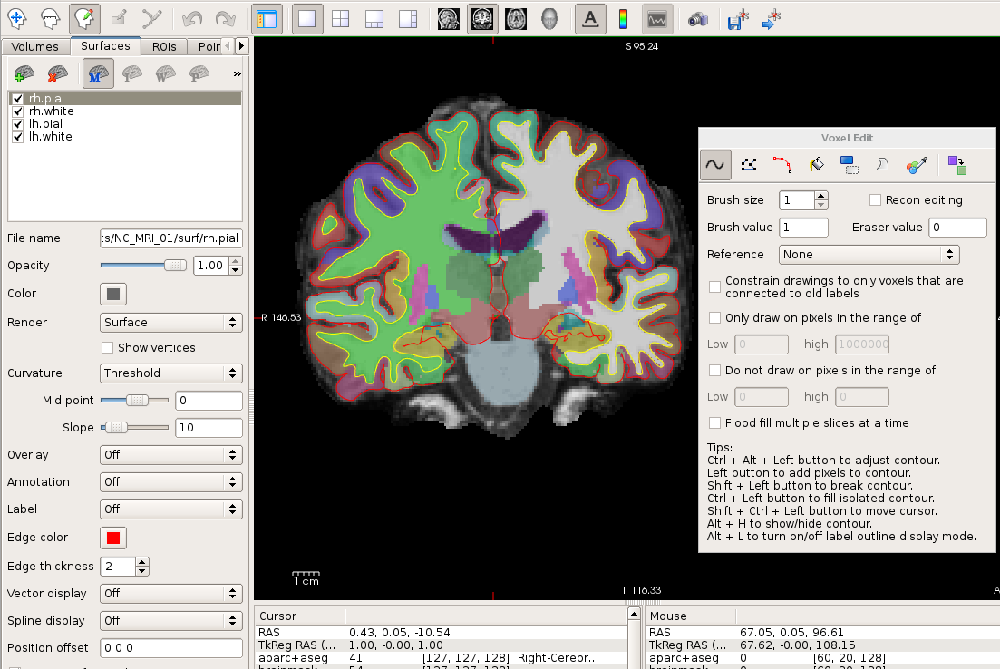

# freesurferを使う(MRI)

ここからターミナルを使っていくことになります。下記は必要最低限のbashのコマンドです。
- cd :閲覧するフォルダへ移動する
- ls :今開いているフォルダの内容を確認する

まず、ターミナルを開きMRIの画像データがある場所まで移動します。
例えばフォルダの名前がDATAなら下記のようにします。
```{frame=single}
cd DATA
```
辿っていって、目的のファイルを見つけたならば、freesurferで解析します。
例えばファイルの名前がhoge.niiなら下記です。
```{frame=single}
recon-all -i ./hoge.nii -subject (患者番号) -all
```
このコマンドを走らせると、完遂するのにおよそ丸１日かかります。
かかりすぎですね？下記で4コア並列できます。
```{frame=single}
recon-all -i ./hoge.nii -subject (患者番号) -all -parallel
```

やっている事は、頭蓋骨を取り除き、皮質の厚さやボリュームの測定、標準脳への置き換え、
皮質の機能別の色分け等、色々な事をしてます。詳しくはfreesurferのサイトを見て下さい。

## recon-all同時掛け(freesurfer)

recon-allはマルチスレッド処理をすることができます。しかし、効率はあまり良くないです。[^openMP]
つまり、マルチコア機なら一例ずつマルチスレッドでかけるより、
同時多数症例をシングルスレッドで掛かける方が速く済みます。
ターミナルを沢山開いて処理させたりすると速いですが煩雑です。
なので、スクリプトを書いて自動化することをおすすめします。
MNEpythonを使う人はプログラミングの習得は必須なので良いとして、
freesurferしか使わない人でもスクリプトは書けるようになる方が便利です。
僕のおすすめはpython、shのいずれかです。

[^openMP]:理由はopenMPというライブラリを使った並列化だからです。openMPはマルチスレッドを簡単に実装する優れたライブラリなのですが、メモリの位置が近い場合にスレッド同士がメモリ領域の取り合いをしてしまうため速度が頭落ちになるのです。

## freesurferの解析結果の表示

freeviewというコマンドで解析済みの画像を表示できます。
上から解剖的に分けたデータを乗せることで部位別の表示ができます。

コマンドラインでは以下のようにすればいいですが、freeviewと叩いてから
画面上からやっていってもいいと思います。
(多くの人は普通の画面上からしたほうが分かりやすいでしょう)

```{frame=single}
freeview -v <subj>/mri/orig.mgz \
hoge/mri/aparc+aseg.mgz:colormap=lut:opacity=0.4 \
```

orig.mgzというのはオリジナル画像。グレイスケールで読みこみましょう。
aparc+aseg.mgzは部位別データ。部位別データには色を付けて読み込みましょう。

画面左側に表示されているのは読み込んだ画像一覧です。
上に半透明の画像を重ねあわせていって上から見ています。
色々できますので、遊んで体で覚えるのが良いと思います。


## 解析結果のまとめ

recon-allが終わった時点で、下記コマンドを入力しましょう。
```{frame=single}
asegstats2table --subjects hoge1 hoge2 hoge3 ...\
  --segno hoge1 hoge2 hoge3 ... --tablefile hoge.csv
```
subjectにはsubject(つまり解析済みデータの通し番号)を入れます。
segnoには見たい位置を入力します。その位置というのは
$FREESURFER_HOME/FreeSurferColorLUT.txtに書かれていますので参照しましょう。

ちなみに、freesurfer6.0の時点でこのコマンドはpython2に依存しています。
python3を使っている人はpython2を何らかの形で併用しましょう。

これでhoge.csvというファイルが出力されます。
このファイルの中には既に脳の各部位のボリュームや皮質の厚さ等、
知りたい情報が詰まっています。しかし、このまま使うのは危険です。
freesurferは時にエラーを起こしますので、クオリティチェックと修正が必要です。

## 画像解析の修正

個別な修正はfreeviewを用いてすることになります。
下記を参照して下さい。
http://freesurfer.net/fswiki/Tutorials

このfreesurferのサイトには、説明用のスライドと動画があり、とてもいいです。
以下、要約です。

+ 脈絡叢や各種膜を灰白質と間違える
	- freeviewで修正してrecon-all(オプション付き)
+ 白質の中で低吸収域を「脳の外側」と間違える
	- freeviewで修正してrecon-all(オプション付き)
+ 白質の中で薄い部分を灰白質と間違える(controlpointより小さい部分)
	- freeviewで修正してrecon-all(オプション付き)
+ 頭蓋骨をくりぬく時に間違って小脳などを外してしまう
	- recon-all(オプション付き)
+ 白質をfreesurferが少なく見すぎてしまう
	- freeviewでcontrolpointsを付け加えてrecon-all(オプション付き)

これは、問題にぶつかった時に上記サイトのスライドでも見ながら頑張るのが良いと思います。
皮髄境界などはfreesurferは苦手としているそうです。

### SkullStripのエラー

Freesurferは脳だけを解析するためにSkull Stripという作業をします。要するに、頭蓋骨を
外してしまうわけです。この時にwatershedmethod[^strip]という方法を使うのですが、頭蓋骨を
切り取ろうとして脳まで取ったり逆に眼球や脈絡叢まで脳と間違うことがあるので修正が必要です。

[^strip]:脳に水を流し込むシミレーションをすることで切っていいところと悪い所を分ける処理

### 脈絡叢の巻き込み

脈絡叢を巻き込んでいる場合はbrainmask.mgzを編集します。
Brush value を255、Eraser valueを1にしてRecon editing
shiftキーを押しながらマウスをクリックして脈絡叢を消していきます。編集がおわったら
```{frame=single}
recon-all  -s <subject>   -autorecon-pial
```
とします。

{width=14cm}

### 眼球が白質と間違われた時

上記と同様にして、編集がおわったら
```{frame=single}
recon-all   -s <subject>  -autorecon2-wm   -autorecon3
```

### 頭蓋骨と間違って脳をえぐっているとき

頭蓋骨と間違って脳実質まで取られた画像が得られた場合は
```{frame=single}
recon-all  -skullstrip  -wsthresh 35  -clean-bm  -no-wsgcaatlas  -s <subj>
```
で調整します。この-wsthreshがwatershedmethodの閾値です。
標準は25なのですが、ここではあまり削り過ぎないように35にしてます。

### 白質の内部に灰白質があると判定されるとき

時々、白質の中の低吸収域を灰白質とか脳溝と間違えることがあります。これもfreeviewで編集します。
wm.mgzを開いて色を付け、半透明にし、T1強調画像に重ねます。
Brush value を255、Eraser valueを1にして
Recon editingをチェックして編集します。

```{frame=single}
recon-all -autorecon2-wm -autorecon3 -subjid <hoge>
```

### 白質が厳しく判定されているとき

実は、freesurferはbrainmask.mgzで白質を全部110という色の濃さに統一します。
しかし、時々これに合わない脳があります。
そんな時はbrainmask.mgzにコントロールポイントをつけてrecon-allをします。

File -> New Point Setを選びます。
Control pointsを選んでOKして、選ばれるべきだった白質を
クリックしていきます。そして下記でいいそうです。

```{frame=single}
recon-all   -s <subject>   -autorecon2-cp   -autorecon3
```
