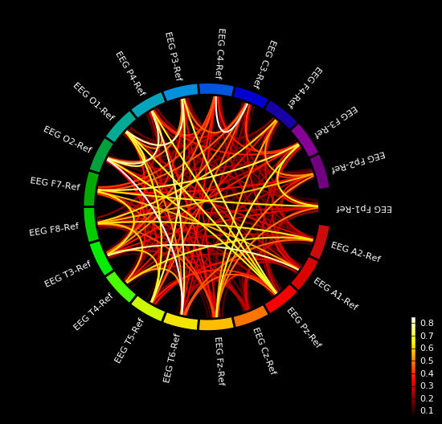

## Connectivity

Connectivityを脳波でやってみましょう。Connectivityは要するに、
脳のあちこちの繋がり具合を調べる指標です。MRIとかでよくされている手法ですね。

MNEpythonでは脳波と脳磁図でこれを計算することが出来ます。
実装されている計算方法を列挙してみます。
まずは、何はなくても計算しやすくする変換をせねば始まりません。
変換方法は下記の3つが提供されています。

- multitaper
- fourier
- morlet wavelet

このうち、multitaperとfourierは離散の計算方法、
morlet waveletは連続wavelet変換です。(今までやってたのと同じ)

フーリエ変換やwavelet変換をした上で、それぞれの値を比較するのです。
比較の方法は下記のとおりです。

- Coherence: Coherencyの絶対値
- Coherency: 純粋に計算で出されたやつ
- ImaginaryCoherence: 同一ソースの影響を除いたもの
- Phase-Locking Value: 純粋に計算で出されたやつ
- Phase Lag Index: 同一ソースの影響を除いたもの
- Weighted Phase Lag Index: PhaseLagIndexに重みを付けたもの

…多すぎですね(´・ω・｀)
どれが良いとかは…よくわかりません。色々やってみたり先行研究を見るのが良いかも？
一応ImaginaryCoherenceとPhaseLagIndex系は同一ソースの影響が少ないので
性能がちょっといいかもしれません？
とりあえず、計算方法を書いておきます。まずは、epochを作ります。作り方は前述のとおりです。
眼球運動や心電図のデータは要らない[^heart]ので、
pick_channelやdrop_channelで要らないのを外していきます。

[^heart]: 大抵は、の話です。心臓の鼓動と脳波のコネクティビティの研究も一応あることは知ってます！

```{frame=single}
epochs.pick_channels(['hoge'])
epochs.drop_channels(['fuga'])
```

では、始めましょう。


```{frame=single}
from mne.connectivity import spectral_connectivity as sc
cons = sc(epochs, method=’coh’, indices=None,
          sfreq=500, mode=’multitaper’, fmin=35, fmax=45, fskip=0,
          faverage=False, tmin=0, tmax=0.5, mt_bandwidth=None,
          mt_adaptive=False, mt_low_bias=True,
          cwt_frequencies=None, cwt_n_cycles=7,
          block_size=1000, n_jobs=1)

```

…基本、我流の僕はソースコードが汚いんですが、今回はあまりにも
一行あたりが長すぎる気がします。オブジェクト指向的にはちょっと…。
自前でオブジェクト作ったほうが楽かもです。
やむを得ず圧縮のためにscと短縮しました…。では、解説いきます。

- method: そのままmethodですね。上記の通り。
- indices: どことどこのconnectivityを見たいかです。
- sfreq: サンプリング周波数です。
- fmin,fmax: 見たい周波数帯域です
- fskip: どのくらい飛び飛びで解析するかです。
- faverage: 最終的に幾つかの周波数を平均した値を出すかどうかです。
- tmin,tmax: どこからどこまでの時間見るか
- cwt_frequencies: morlet waveletの時の周波数(numpy形式の数列)
- cwt_n_cycles: morlet waveletの波の数
- block_size,n_jobs: 一度にどのくらい計算するか

この関数は、中々~~詰め込み~~多機能な関数です。
なんと、上記の沢山のmethodを全部できます。出来るがゆえの大変さもあります。
この関数には5つの返り値と、実質4つのモードがあると考えるとやりやすいと思います。
それぞれについて解説します。

### 5つの返り値

さっきの関数には5つの返り値があります。順に

- con: connectivity numpy形式
 幾つかパターンあるのであとで書きます
- freqs: 周波数
 何故ここで周波数が出てきたか一瞬怪訝に思いそうですが、
 これはfourierとmultitaperモードの時に力を発揮します。
 というのは、離散的な演算をするので、**周波数は関数が勝手に設定する**からです。
 morlet waveletの場合はcwt_frewuenciesで設定した物が出てきます。
- times: 解析に使った時刻のリスト
- n_epochs: 解析に使ったepochの数
- n_tapers: multitaperの時だけnullとして出力
 DPSSという値が格納されます。

上記のコードではconsという変数にタプルを入れているので、
cons[0]がcon、cons[2]がtimesです。

この中で大事なのはconです。何故なら、これが結果だからです。
conの中で一番大事なのは中に入っている三角行列です。
三角行列というのは、行列の対角より上か下が全部0で出来ている行列です。


### fourier/multitaperモード
fourierやmultitaperは時間軸がないです。その辺がmorlet waveletと違うところです。
conの内容は[チャンネル数 X チャンネル数 X 周波数]という三次元配列になります。
この内、チャンネル数 X チャンネル数 の部分が三角行列になります。
周波数は、関数が勝手に「これがいいよ」と言って抜き出してきた
離散的な周波数になります。

ここで、幾つかの周波数について個別にやりたいなら話は違うのですが、
加算平均したいなら下記のコードで十分です。
```{frame=single}
conmat=np.mean(con,axis=(2))
```
これで、conmatに三角行列が入りました。

### waveletモード
morlet waveletは乱暴に言うとfourierに時間軸を与える拡張版です。
[チャンネル数 X チャンネル数 X 周波数 X 時間]という4次元になります。
この場合は下記のコードで三角行列を作りましょう。
```{frame=single}
conmat=np.mean(con,axis=(2,3))
```
三角行列が出来ました。

### plot
さっきの2つは三角行列を作るモードでした。
三角行列がある場合は綺麗なplotが出来ます。下記のとおりです。
```{frame=single}
mne.viz.plot_connectivity_circle(conmat, epochs.ch_names)
```



### indicesモード
三角行列関連は、要するに全部入りな感じの計算でした。
indicesというところに引数を入れると、特定のconnectivityだけ計算してくれます。
```{frame=single}
indices = (np.array([0, 0, 0]),
           np.array([2, 3, 4]))
```
このようにnumpy配列を作ります。1列目は何番目のチャンネルとそれぞれを見比べたいか。
2列目はそれぞれのチャンネルです。ここでは
0 →  2 , 0 →  3 , 0 →  4 番目のチャンネルを比べています。

で、このindicesを引数として入れるとどうなるかというと、
fourier/multitaperモードなら[見比べたチャンネルの数 X 周波数]となります。
morlet waveletモードなら[見比べたチャンネルの数 X 周波数 X 時間]となります。
