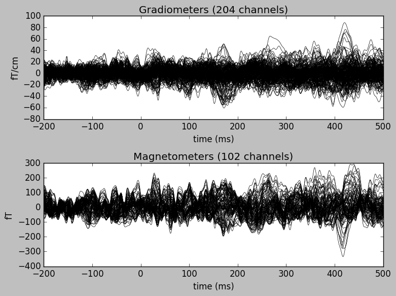

## データのplot、主にjupyter周り、そしてPySurfer

是非自らplotしてみてください。
何をやっているのか理解が早まると思います。
```{frame=single}
epochs.plot()
evoked.plot()
```

{width=14cm}

{width=14cm}

epochsやrawをプロットしたとき、どうなったでしょうか？
jupyterではどのように表示するかを選ぶことが出来ます。

jupyterにそのまま表示したい場合は下記を先にjupyter上で実行してください。
```{frame=single}
%matolotlib inline
```
別のwindowに表示したいときは下記のようにしてください。
```{frame=single}
%matplotlib qt
```
また、3D画像を表示したい場合は
```{frame=single}
%gui qt
```
jupyterに表示するメリットはjupyter自体を実験ノート風に使えること、
別ウィンドウに表示するメリットはrawやepoch等大きなデータを表示する時に
スクロールさせることが出来ることです。

実はjupyter上でスクロール出来る表示もあるのですが、重くてあまり良くないです。
詳しくはqiitaで検索してください。親切な記事がいくらでもあります。

また、PySurferについては例えば下記のような感じです。
これはmacの場合ですが、ubuntuも同じ感じです。
subjectやsubjects_dirはfreesurferの設定で読み替えてください。
jupyterで下記の呪文を唱えましょう。
```{frame=single}
import surfer
%gui qt
```
そしてこうです。この場合ブロードマン１を赤く塗っています。

```{frame=single}
brain = surfer.Brain(subject, "lh", "inflated",
subjects_dir=subjects_dir)
brain.add_label("BA1.thresh", color="red")
```
注意すべき点として、拡張子や左右半球にかんしてはadd_label関数では
省略して入力する必要があります。

{width=14cm}

ちなみに、labelファイルはそれぞれのsubjectの中のlabelフォルダの中にあります。
このlabelについてはブロードマンの脳磁図ベースの古典的なものが多いですね。
新しい系はannotファイルの中に多いです。

{width=14cm}

```{frame=single}
brain = surfer.Brain(subject, "lh", "inflated",
subjects_dir=subjects_dir)
brain.add_annotation('aparc.a2009s')
```

沢山表示されていますね。僕はちょっと気持ち悪いなぁと思いました。

## 多チャンネル抜き出し

もし、多チャンネルのevokedを平均したものを割り出したいなら
貴方はnumpyを使うことになります。
ここでは脳波のevokedを例にしておきます。他のデータでも応用ききます。
下記のチャンネルを選択したいとします。
```{frame=single}
channel=['Fz','FCz','FC1','FC2','Cz','C1','C2','F1','F2']
```

pythonの配列では、中の項目を逆引きで探し出す.index()関数があります。
加工した波形データは.data変数の中に格納されています。その一番初めの情報が
チャンネル別なので、1チャンネル…例えば'Fz'なら下記のようにすれば割り出せます。
```{frame=single}
evoked.data[evoked.info['ch_names'].index('Fz')]
```
この'Fz'をfor文で書きかえていけば良いのです。
```{frame=single}
data=[]
for ch in channel:
  data.append(evoked.data[evoked.info['ch_names'].index(ch)])
```
ちなみに、下記のように書くのがよりpythonicと思われます。
これはリスト内包表記と言って、pythonistaが好んで使う方法です。
```{frame=single}
data=[evoked.data[evoked.info['ch_names'].index(ch)] for ch in channel]
```
