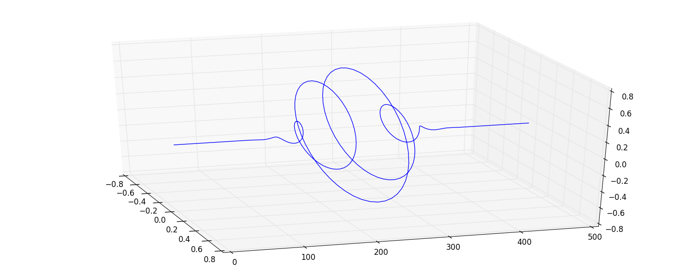

## センサーレベルwavelet変換

これは解析のゴールの一つと言えましょう。

### そもそもwavelet変換とは何なのか

特定の周波数の波の強さや位相を定量化するための計算方法です。
僕は数学が苦手なので、適当な説明です。フーリエ変換という言葉をご存知でしょうか？
これは波をsin波の複合体として解釈することで波を一つの式として表す方法です。
ほぼ全ての波はフーリエ変換によって近似的に変換できるのです。
凄いですね！しかし、これには欠点があります。不規則な波の変化に対応できないのです。
何故なら、sin波は未来永劫減衰しない波だからです。
フーリエ変換において、波は未来永劫つづくのが前提なのです。
(擬似的に切り取ることは出来る)

そこで、減衰するwaveletという波を使って波を表す方法を使います。
そのため、減衰する波を単純な数式で表現する必要があります。
これを理解するためには高校数学を理解する必要があります。
詳しくは後半の「初心者のための波形解析」を御覧ください。

{width=14cm}

{width=14cm}


### wavelet変換にまつわる臨床的な単語

脳活動に関する用語としては以下のようなものがあります。
(ただし、コネクティビティ系は除く)

| 単語                 | 内容                                              |
|----------------------|---------------------------------------------------|
| total power          | 何らかの刺激を受けて出てくるpower                 |
| evoked power         | 何らかの刺激を受けた直後にだけ出るpower           |
| induced power        | 何らかの刺激を受けて暫く出続けるevoked以外のpower |
| phase locking factor | 同一部位での位相同期性                            |

どういうことでしょう？
つまり、何か刺激を受けた時に「受け取った刺激に関する手続き」がevoked
何か刺激を受けた後、それを「ゴチャゴチャ脳内で処理する手続き」がinduced
上記の合算がtotalです。

total powerは簡単に計算できます。単にwavelet変換してその振幅を二乗すれば
それで終わりであります。
evoked powerは二種類の出し方があります。まぁ、流派みたいなものでしょうか。
induced powerもまた、二種類の出し方があります。
これは後で書きます。

このなかで、phase locking factorは別名 inter-trial coherence(itc)といいます。
MNEpythonではitcという言い方しています。[^plv]
それぞれ生理学的には違うものを見ているらしいです。
MNEpythonではinduced powerとitcの計算方法が実装されています。[^evoked_power]
これらの特徴の違いが何故生まれるかについても後半の
「初心者のための波形解析」を御覧ください。

ではevoked power,induced power,phase locking factorについて
解析を行いましょう。

[^plv]: ちなみにphase locking valueという全然別のものがあります。これはコネクティビティ用語ですので分野が違います。あとで書きます。
[^evoked_power]: これは実質itcと似たようなもの…という考え方もあります。

### 2つの流儀とMNE
2つの流儀について話します。
名前については適当につけました。

#### 合算派
合算派のやり方を書きます。


### wavelet変換の実際

morletのやり方は臨床研究的にメジャーなやり方と僕は思っています。
下記のスクリプトで実行できます。

```{frame=single}
freqs=np.arange(30,100,1)
n_cycles = 6
evoked_power=mne.time_frequency.tfr_morlet(evoked,n_jobs=4,
  freqs=freqs,n_cycles=n_cycles, use_fft=True,
  return_itc=False, decim=1)
```

- freqs : どの周波数帯域について調べるか。
 上の例では30Hzから100Hzまで1Hz刻みに計算しています。
- n_cycles : 一つのwaveletに含まれる波のサイクル数。
 5~7という値で固定する方法がよく用いられます。
　MNEではこのサイクル数を可変にすることも出来ます。
- n_jobs : CPUのコアをいくつ使うか。重い処理なのです。
 ちなみに、n_jobsを大きくするよりも、n_jobsを1にして
 同時にたくさん走らせたほうが速いです…が、メモリは食います。
- use_fft : FFTによる高速wavelet変換を行うかどうか。
 数学の話になるので、詳しい所は本書では扱いません。
 要するに速く計算するかどうかです、Trueでいいかと。
- decim : この値を大きくすると処理が軽くなりますが、
 出力結果がちょっと荒くなります。
- return_itc : これをTrueにするとphaselocking factorも
 算出してくれます。

この関数はevokedもepochsも引数として取ることが出来ます。
return_itcがTrueかFalseかでも大きく挙動が違います。
挙動の組み合わせについてですが、下記のとおりです。

| return_itc | 引数   | 返り値1つ目   | 返り値2つ目         |
|------------|--------|---------------|---------------------|
| False      | evoked | evoked_power  | なし                |
| False      | epochs | induced_power | なし                |
| True       | epochs | induced_power | phaselocking_factor |

itcを計算したい時は返り値が2つになりますから、下記のです。

```{frame=single}
freqs=np.arange(30,100,1)
n_cycles = 6
induced_power,plf=mne.time_frequency.tfr_morlet(epochs,n_jobs=4,
  freqs=freqs,n_cycles=n_cycles, use_fft=True,
  return_itc=False, decim=1)
```

ここで一つ注意点があります。
wavelet変換は基準になる波を実際の波に掛け算して行うのですが、
波の始まりと終わりのところだけは切れちゃうはずです。
そこは十分注意して下さい。
どの程度のwaveletの波の長さなのかについては、
頑張って計算して下さい。(余裕があれば書くかも)
